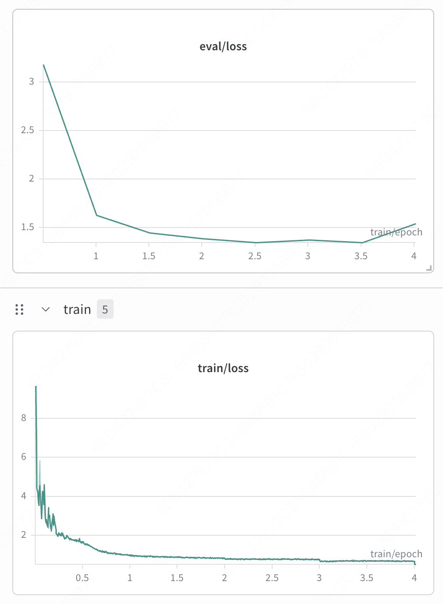

# 2026-04-01 Games-grec 全流程实验记录（qwen3-embedding-4B index + Qwen2.5-3B SFT/RL）

- 记录日期：2026-04-01
- 维护日期：2026-04-02
- 记录目的：把 `Games` 数据集从 `index -> grec preprocess -> SFT -> 后续 RL / evaluate` 的关键信息集中到一份文档里，后面继续往同一篇里补 `rule_only`、`fixed_hint` 等 RL 结果。
- 当前阶段：`index` 已训练并导出，`Games_grec` 数据已构建，`Games-grec` SFT 已完成，`rule_only` / `fixed_hint` / `dynamic-hint` 三条 RL 线已经产出首批 checkpoint 评测结果。
- 相关 W&B：
  `https://wandb.ai/wncfht/MIMIGenRec-SFT/runs/2trpxzle`

## 一句话结论

`Games` 单数据集的 `qwen3-embedding-4B + rq4(cb256x4)` semantic index 已成功训练并导出，最终 generate 阶段碰撞率为 `0.0075873`；基于该 index 的 `Games_grec` 下游数据也已构建完成。`Games-grec-sft-qwen4B-4-256-dsz0` 的当前最佳 SFT 点按 `NDCG@10` 看是 `checkpoint-768`（`0.0433`），而后续 RL 默认从更稳妥的 `checkpoint-896` 起跑。当前本地 `results` 显示，三条 RL 线里最好的是 `dynamic-hint`，在 `checkpoint-4380` 达到 `NDCG@10=0.0464`、`HR@10=0.0823`、`HR@50=0.1980`；`fixed-hint` 与它接近，`rule_only` 稍弱但仍整体优于 SFT。

## 1. 本地整理后的材料

本次下载回本地并整理进素材目录的文件：

- `docs/assets/2026-04-01-games-grec-qwen4b-4-256/all_results.json`
- `docs/assets/2026-04-01-games-grec-qwen4b-4-256/trainer_log.jsonl`
- `docs/assets/2026-04-01-games-grec-qwen4b-4-256/sft_wandb_loss_curves.png`

后面如果再下载：

- `trainer_state.json`
- `train_results.json`
- `eval_results.json`
- RL 的 `metrics.json`

建议也统一放到这个目录里，不要再散落到 `docs/` 根目录。

## 2. Index 训练结果

### 2.1 配置

| 项目 | 值 |
| --- | --- |
| Dataset | `Games` |
| Embedding model | `qwen3-embedding-4B` |
| Index config | `rq4_cb256-256-256-256` |
| `sk_eps` | `0.0-0.0-0.0-0.003` |
| Batch size | `256` |
| LR | `0.001` |
| Epoch | `500` |
| KMeans tag | `kmtrue-lkmtrue-kmi100` |
| 训练目录 | `index_train_runs/Games/index/qwen3-embedding-4B/rq4_cb256-256-256-256_sk0.0-0.0-0.0-0.003_kmtrue-lkmtrue-kmi100/Apr-01-2026_19-21-03/` |

### 2.2 核心结果

| 指标 | 值 |
| --- | ---: |
| All indices number | `13839` |
| Unique indices | `13734` |
| Max number of conflicts | `5` |
| Final collision rate | `0.007587253414264037` |
| Training best collision rate | `0.04754678806272129` |
| Avg utilization | `0.7959` |
| Layer 0 utilization | `47 / 256` |
| Layer 1/2/3 utilization | `256 / 256` |

### 2.3 导出产物

- 完整带 run-id 的导出：
  `/mnt/dolphinfs/hdd_pool/docker/user/hadoop-hmart-poistar/fanghaotian/data/Games/Games.index_emb-qwen3-embedding-4B_rq4_cb256-256-256-256_dsGames_ridApr-01-2026-19-21-03.json`
- 稳定 alias：
  `/mnt/dolphinfs/hdd_pool/docker/user/hadoop-hmart-poistar/fanghaotian/data/Games/Games.index_emb-qwen3-embedding-4B_rq4_cb256-256-256-256_dsGames.json`

可直接引用的观察：

- generate 阶段最终只剩约 `105` 个 item 还发生冲突，说明这个 `Games` cb256 index 已经足够进入下游 SFT/RL。
- codebook 利用率明显不均衡，第 0 层严重欠利用，后 3 层全部打满；这后面值得作为单独分析点。

## 3. GREC 下游数据构建结果

### 3.1 构建入口

使用的脚本是：

```bash
bash scripts/run_games_preprocess_grec.sh build
```

对应数据变体：

- `Games_grec_index_emb-qwen3-embedding-4B_rq4_cb256-256-256-256_dsGames`

### 3.2 样本规模

#### 原始 split

| Split | Rows |
| --- | ---: |
| Train | `246737` |
| Valid | `42259` |
| Test | `42259` |

#### 最终导出规模

| 输出 | 样本数 |
| --- | ---: |
| SFT train | `520761` |
| SFT valid | `42259` |
| SFT test | `42259` |
| RL train | `280110` |
| RL valid | `42259` |
| RL test | `42259` |

#### 任务拆分

| Task | 说明 | 样本数 |
| --- | --- | ---: |
| Task1 `SidSFT` | `sft, rl, train, valid, test` | train `246737`, valid `42259`, test `42259` |
| Task2 `SidItemFeat` | `sft, train only` | `27287` |
| Task3 `FusionSeqRec` | `sft, history_sids -> title` | train `246737` |
| Task4 `Title2Sid` | `rl, train only` | `10000` |
| Task5 `TitleDesc2Sid` | `rl, train only` | `23373` |

### 3.3 下游关键路径

- `new_tokens.json`：
  `/mnt/dolphinfs/hdd_pool/docker/user/hadoop-hmart-poistar/fanghaotian/GenRec/data/Games_grec_index_emb-qwen3-embedding-4B_rq4_cb256-256-256-256_dsGames/new_tokens.json`
- `id2sid.json`：
  `/mnt/dolphinfs/hdd_pool/docker/user/hadoop-hmart-poistar/fanghaotian/GenRec/data/Games_grec_index_emb-qwen3-embedding-4B_rq4_cb256-256-256-256_dsGames/id2sid.json`
- `sft/train.json`：
  `/mnt/dolphinfs/hdd_pool/docker/user/hadoop-hmart-poistar/fanghaotian/GenRec/data/Games_grec_index_emb-qwen3-embedding-4B_rq4_cb256-256-256-256_dsGames/sft/train.json`
- `rl/train.json`：
  `/mnt/dolphinfs/hdd_pool/docker/user/hadoop-hmart-poistar/fanghaotian/GenRec/data/Games_grec_index_emb-qwen3-embedding-4B_rq4_cb256-256-256-256_dsGames/rl/train.json`

## 4. Games-grec SFT 结果

### 4.1 训练入口与输出目录

使用配置：

- YAML：
  `examples/train_full/Games/games_rec_full_sft_3b_dsz0_qwen4b_4_256_grec.yaml`
- 输出目录：
  `/mnt/dolphinfs/hdd_pool/docker/user/hadoop-hmart-poistar/fanghaotian/GenRec/saves/qwen2.5-3b/full/Games-grec-sft-qwen4B-4-256-dsz0`
- W&B run：
  `https://wandb.ai/wncfht/MIMIGenRec-SFT/runs/2trpxzle`

从你给的远端目录看，当前已有这些 checkpoint：

- `checkpoint-128`
- `checkpoint-256`
- `checkpoint-384`
- `checkpoint-512`
- `checkpoint-640`
- `checkpoint-768`
- `checkpoint-896`
- `checkpoint-1024`

### 4.2 本地汇总结果

来自 `docs/assets/2026-04-01-games-grec-qwen4b-4-256/all_results.json`：

| 指标 | 值 |
| --- | ---: |
| `epoch` | `4.015728680265421` |
| `eval_loss` | `1.5388939380645752` |
| `train_loss` | `1.0617161795380525` |
| `train_runtime` | `30410.2605 s` |
| `train_samples_per_second` | `171.245` |
| `train_steps_per_second` | `0.084` |
| `eval_runtime` | `141.3615 s` |
| `eval_samples_per_second` | `298.943` |
| `eval_steps_per_second` | `2.342` |
| `total_flos` | `1.2549072324726358e+19` |

### 4.3 训练日志摘记

来自 `docs/assets/2026-04-01-games-grec-qwen4b-4-256/trainer_log.jsonl`：

| 项目 | 值 |
| --- | ---: |
| 记录条数 | `1033` |
| 纯 train loss 记录数 | `1024` |
| eval loss 记录数 | `8` |
| 最小 train loss | `0.5094`（step `1023`） |
| 最后一个 train loss | `0.5165`（step `1024`） |
| 最后一个 eval loss | `1.5388939380645752`（step `1024`） |
| 最后记录的 epoch | `4.015728680265421` |
| 最后记录的 current step | `1024` |
| 总计划 step | `2550` |

可直接写进实验记录的观察：

- `train/loss` 从开头的 `9.6+` 很快下降到 `2` 以下，后段稳定在 `0.5x`。
- `eval/loss` 从图上看先快速下降，之后在 `1.3x ~ 1.5x` 区间震荡。
- 当前本地汇总文件只覆盖到 `checkpoint-1024` / `epoch≈4.02`，因此这次 SFT 结果记录应该按“训练在第 4 个 epoch 左右结束/停止”来表述，不要误写成跑满了配置里的 `10 epoch`。

### 4.4 W&B 曲线截图

下图来自你给的 W&B 页面截图，已经归档到：
`docs/assets/2026-04-01-games-grec-qwen4b-4-256/sft_wandb_loss_curves.png`



从截图目测可以补一句：

- `eval/loss` 在前期大幅下降，2 到 3 epoch 左右达到较低区间，后段略有回升；
- `train/loss` 则持续下降并在后段进入缓慢收敛区。

### 4.5 已完成的 checkpoint 评测结果

截至 `2026-04-03`，本地 `results/Games-grec-sft-qwen4B-4-256-dsz0/` 下已经有 8 个 checkpoint 的评测结果：

| Checkpoint | NDCG@10 | HR@10 | NDCG@5 | HR@5 | NDCG@50 | HR@50 |
| --- | ---: | ---: | ---: | ---: | ---: | ---: |
| `checkpoint-128` | `0.0036` | `0.0075` | `0.0026` | `0.0044` | `0.0059` | `0.0177` |
| `checkpoint-256` | `0.0184` | `0.0348` | `0.0144` | `0.0222` | `0.0320` | `0.0981` |
| `checkpoint-384` | `0.0326` | `0.0598` | `0.0258` | `0.0385` | `0.0536` | `0.1568` |
| `checkpoint-512` | `0.0377` | `0.0700` | `0.0292` | `0.0437` | `0.0622` | `0.1833` |
| `checkpoint-640` | `0.0426` | `0.0788` | `0.0333` | `0.0499` | `0.0680` | `0.1958` |
| `checkpoint-768` | `0.0433` | `0.0804` | `0.0336` | `0.0503` | `0.0691` | `0.1998` |
| `checkpoint-896` | `0.0430` | `0.0790` | `0.0340` | `0.0507` | `0.0687` | `0.1970` |
| `checkpoint-1024` | `0.0374` | `0.0692` | `0.0294` | `0.0443` | `0.0597` | `0.1729` |

可以直接记住这几个结论：

- 按 `NDCG@10` 看，当前最优点是 `checkpoint-768`，达到 `0.0433`。
- `checkpoint-896` 不是全局最优，但与 `768` 非常接近，且 `NDCG@5` / `HR@5` 略高。
- `checkpoint-1024` 出现了比较明显的回落，因此不建议再把它当作 RL 初始化点。

### 4.6 RL 起跑点选择

当前建议把 `checkpoint-896` 作为后续 RL 的初始化点。

原因：

- 它处在后段高性能区间，指标与 `768` 很接近，没有明显掉出平台期。
- 相比 `1024`，`896` 避开了末尾已经出现的退化。
- 如果目标是从一个“接近最优、但还没明显过拟合/回落”的点继续做 RL，`896` 是比 `1024` 更稳妥的选择。

换句话说：

- 如果你想追求最强 SFT 单点基线，文档里应记 `768` 是当前 best `NDCG@10`；
- 如果你想挑一个更适合继续接 RL 的后段 checkpoint，当前可以优先用 `896`。

## 5. 现在能不能直接用统一评测脚本

可以。

当前 [`scripts/evaluate_all_checkpoints.sh`](/Users/fanghaotian/Desktop/src/GenRec/scripts/evaluate_all_checkpoints.sh) 已经支持：

- `Games` 默认数据映射
- `Games-grec*` 的自动 variant 识别

所以你现在要只评测这条 SFT 线，可以直接跑：

```bash
INCLUDE_SFT=1 \
INCLUDE_RL=0 \
MODEL_FILTER="Games-grec-sft-qwen4B-4-256-dsz0" \
bash scripts/evaluate_all_checkpoints.sh
```

我建议第一次先 dry-run 看计划：

```bash
INCLUDE_SFT=1 \
INCLUDE_RL=0 \
MODEL_FILTER="Games-grec-sft-qwen4B-4-256-dsz0" \
DRY_RUN=1 \
bash scripts/evaluate_all_checkpoints.sh
```

正常情况下，它会自动把 `Games-grec-sft-qwen4B-4-256-dsz0` 映射到：

- `data/Games_grec_index_emb-qwen3-embedding-4B_rq4_cb256-256-256-256_dsGames/sft/test.json`
- `data/Games_grec_index_emb-qwen3-embedding-4B_rq4_cb256-256-256-256_dsGames/id2sid.json`

## 6. 后续命令

### 6.1 先把 SFT 评测补上

```bash
INCLUDE_SFT=1 \
INCLUDE_RL=0 \
MODEL_FILTER="Games-grec-sft-qwen4B-4-256-dsz0" \
bash scripts/evaluate_all_checkpoints.sh
```

### 6.2 再跑 `rule_only` RL（从 `checkpoint-896` 开始）

```bash
bash hope/Qwen2_5-3B-Isntruct-qwen4B-4-256-MIMIGenRec-Games-grec/Qwen2_5-3B-Isntruct-qwen4B-4-256-MIMIGenRec-Games-grec-rl-rule-only.sh \
  --model-path /mnt/dolphinfs/hdd_pool/docker/user/hadoop-hmart-poistar/fanghaotian/GenRec/saves/qwen2.5-3b/full/Games-grec-sft-qwen4B-4-256-dsz0/checkpoint-896
```

### 6.3 然后跑 `fixed_hint` RL（同样从 `checkpoint-896` 开始）

```bash
bash hope/Qwen2_5-3B-Isntruct-qwen4B-4-256-MIMIGenRec-Games-grec/Qwen2_5-3B-Isntruct-qwen4B-4-256-MIMIGenRec-Games-grec-rl-rule-only-fixed-hint.sh \
  --model-path /mnt/dolphinfs/hdd_pool/docker/user/hadoop-hmart-poistar/fanghaotian/GenRec/saves/qwen2.5-3b/full/Games-grec-sft-qwen4B-4-256-dsz0/checkpoint-896
```

### 6.4 RL 完成后统一评测

```bash
MODEL_FILTER="Games-grec" \
bash scripts/evaluate_all_checkpoints.sh
```

## 7. 当前还缺什么

这篇文档现在已经覆盖了：

- `Games` index 训练
- `Games_grec` 数据构建
- `Games-grec` SFT 训练完成状态
- SFT 评测入口
- RL 下一步命令

后面还需要继续补：

1. SFT 真正的 `metrics.json`
2. `rule_only` RL 的训练轨迹和 checkpoint 评测
3. `fixed_hint` RL 的训练轨迹和 checkpoint 评测
4. 三条线（SFT / RL rule_only / RL fixed_hint）的横向对比结论

## 8. RL 首批结果（2026-04-11 同步）

### 8.1 `rule_only` 结果

目录：
`results/Games-grec-grpo-rule-only-rerun-quietlog-qwen2.5-3b-qwen4B-4-256-from-sft896`

| Checkpoint | NDCG@10 | HR@10 | NDCG@5 | HR@5 | NDCG@50 | HR@50 |
| --- | ---: | ---: | ---: | ---: | ---: | ---: |
| `checkpoint-876` | `0.0411` | `0.0730` | `0.0331` | `0.0482` | `0.0627` | `0.1728` |
| `checkpoint-1752` | `0.0439` | `0.0785` | `0.0351` | `0.0509` | `0.0660` | `0.1806` |
| `checkpoint-2628` | `0.0447` | `0.0787` | `0.0365` | `0.0531` | `0.0671` | `0.1818` |

观察：

- `rule_only` 相比 SFT `checkpoint-896`（`NDCG@10=0.0430`）有稳定提升。
- 当前最好点是 `checkpoint-2628`，但提升幅度不算大，主要增益体现在 `NDCG@5` 和 `NDCG@10`。
- `HR@50` 仍低于另外两条 hint 系列 RL。

### 8.2 `fixed_hint` 结果

目录：
`results/Games-grec-grpo-rule-only-fixedhint-taskfix-b16-sft896`

| Checkpoint | NDCG@10 | HR@10 | NDCG@5 | HR@5 | NDCG@50 | HR@50 |
| --- | ---: | ---: | ---: | ---: | ---: | ---: |
| `checkpoint-876` | `0.0432` | `0.0775` | `0.0345` | `0.0504` | `0.0679` | `0.1912` |
| `checkpoint-1752` | `0.0456` | `0.0823` | `0.0365` | `0.0539` | `0.0708` | `0.1978` |
| `checkpoint-2628` | `0.0461` | `0.0833` | `0.0367` | `0.0540` | `0.0714` | `0.2001` |

观察：

- `fixed_hint` 从第一个 checkpoint 开始就显著强于 plain `rule_only`。
- 当前最好点是 `checkpoint-2628`，`NDCG@10=0.0461`，已经明显超过当前 SFT best。
- `HR@50=0.2001` 是目前三条线里第一个破 `0.20` 的结果。

### 8.3 `dynamic-hint` 结果

目录：
`results/Games-grec-grpo-rule-only-dynamic-hint-cascade-qwen2.5-3b-qwen4B-4-256-from-sft896`

| Checkpoint | NDCG@10 | HR@10 | NDCG@5 | HR@5 | NDCG@50 | HR@50 |
| --- | ---: | ---: | ---: | ---: | ---: | ---: |
| `checkpoint-876` | `0.0431` | `0.0785` | `0.0341` | `0.0506` | `0.0680` | `0.1937` |
| `checkpoint-1752` | `0.0442` | `0.0792` | `0.0352` | `0.0512` | `0.0692` | `0.1945` |
| `checkpoint-2628` | `0.0452` | `0.0808` | `0.0363` | `0.0533` | `0.0705` | `0.1976` |
| `checkpoint-3504` | `0.0461` | `0.0822` | `0.0372` | `0.0544` | `0.0714` | `0.1981` |
| `checkpoint-4380` | `0.0464` | `0.0823` | `0.0374` | `0.0543` | `0.0716` | `0.1980` |

观察：

- `dynamic-hint` 的增长更持续，checkpoint 数更多，而且从 `2628` 往后还在缓慢提升。
- 当前最好点是 `checkpoint-4380`，按 `NDCG@10` 看是目前 `Games-grec` 的全场最好结果。
- 相比 `fixed_hint`，`dynamic-hint` 的优势主要体现在 `NDCG@10` / `NDCG@5`，而 `HR@50` 两者接近。

### 8.4 三条 RL 线横向对比

按当前已同步到本地的最好 checkpoint 比：

| 路线 | Best checkpoint | NDCG@10 | HR@10 | NDCG@50 | HR@50 |
| --- | --- | ---: | ---: | ---: | ---: |
| SFT | `checkpoint-768` | `0.0433` | `0.0804` | `0.0691` | `0.1998` |
| RL `rule_only` | `checkpoint-2628` | `0.0447` | `0.0787` | `0.0671` | `0.1818` |
| RL `fixed_hint` | `checkpoint-2628` | `0.0461` | `0.0833` | `0.0714` | `0.2001` |
| RL `dynamic-hint` | `checkpoint-4380` | `0.0464` | `0.0823` | `0.0716` | `0.1980` |

当前可以直接写进结论里的版本：

- plain `rule_only` 能把 `NDCG@10` 从 SFT 的 `0.0433` 提升到 `0.0447`，但对 `HR@50` 没有优势。
- `fixed_hint` 和 `dynamic-hint` 都明显优于 plain `rule_only`。
- 按当前本地结果，`dynamic-hint` 是 `NDCG@10` 最优（`0.0464`），`fixed_hint` 非常接近（`0.0461`）。
- 如果更看重 `HR@50`，当前 `fixed_hint` 的 `0.2001` 略优；如果更看重 `NDCG@10` / `NDCG@5`，当前 `dynamic-hint` 更强。

### 8.5 当前下一步

如果你现在要继续推进实验，建议顺序是：

1. 先把 `dynamic-hint` / `fixed_hint` 的更多 checkpoint 同步齐，确认后段是否还继续上升。
2. 如果要写阶段性结论，现在已经足够写一版：
   `dynamic-hint ≳ fixed-hint > rule_only > SFT`（按 `NDCG@10`）。
3. 后续若要继续扩展，可以考虑：
   - 做更长训练，确认 `dynamic-hint` 是否在 `4380` 后继续涨
   - 检查 `fixed_hint` 是否存在更好的 beam/depth 组合
   - 补一张三条 RL 线与 SFT 的 epoch-aligned 曲线图
