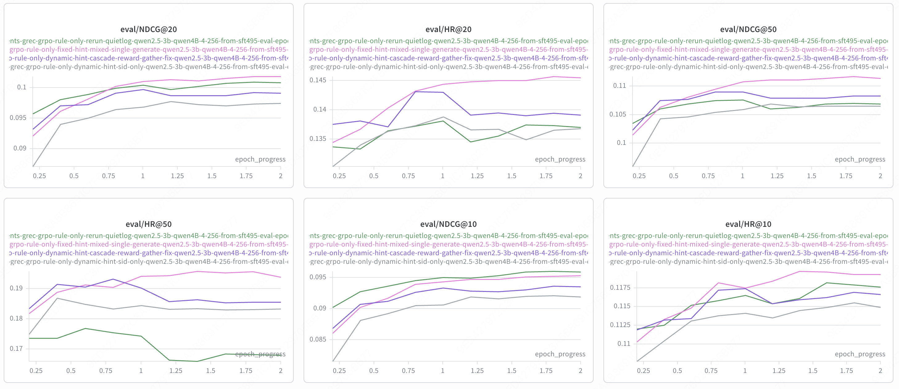
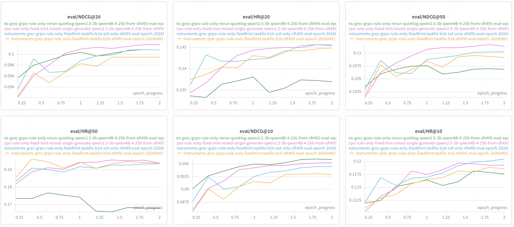
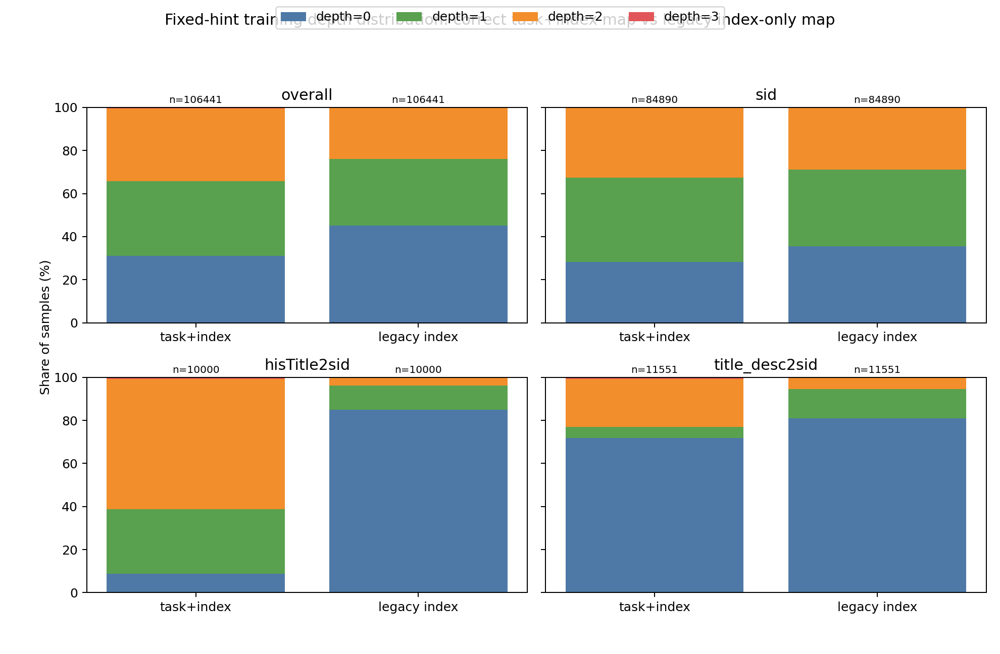
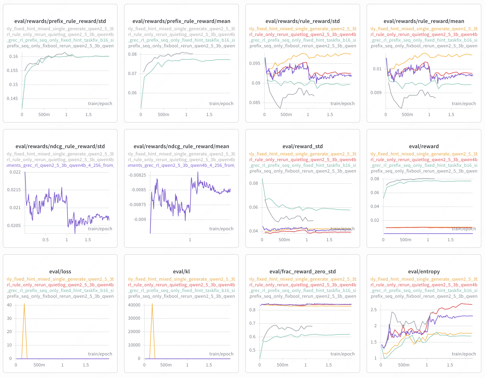

# GenRec 周报（2026-04-02，Epoch 口径）

- epoch 口径：统一用 `epoch_progress = ckpt_step / max_ckpt_step * num_train_epochs`
  - RL 按 `2` epoch
  - SFT 按 `10` epoch

## 1. 本周结论

1. `rule_only rerun` 仍然是 `Instruments-grec` 上 top-10 最强的 RL 线，best 在 `epoch≈1.802`，`NDCG@10=0.0960`，但 `HR@50=0.1681`，仍低于 SFT-256 的 `0.1844`。
2. 本周最值得讲的新结果是 corrected fixed-hint，尤其是 `fixedhint-taskfix-b16-sid-only`：best 在 `epoch≈1.805`，`NDCG@10=0.0945`，`HR@10=0.1201`，`NDCG@50=0.1103`，`HR@50=0.1933`。
3. `fixedhint-taskfix-b16-sid-only` 相比 `rule_only rerun` 只少 `0.0015` 的 `NDCG@10`，但 `HR@50` 多 `0.0252`，说明 corrected fixed-hint 仍然是当前最平衡的方向。
4. 这周新增的 `fixed hint + prefix seq reward` 没有看到优于 `fixed hint + rule only` 的证据，暂时不建议作为主线继续打。

## 2. 主线结果

| Variant | Best Epoch | NDCG@10 | HR@10 | NDCG@50 | HR@50 |
| --- | ---: | ---: | ---: | ---: | ---: |
| `Instruments-grec-sft-qwen4B-4-256-dsz0` | 7.857 | 0.0823 | 0.1094 | 0.0985 | 0.1844 |
| `Instruments-grec-grpo-rule-only-rerun-quietlog-qwen2.5-3b-qwen4B-4-256-from-sft495` | 1.802 | 0.0960 | 0.1179 | 0.1070 | 0.1681 |
| `Instruments-grec-grpo-rule-only-dynamic-hint-cascade-reward-gather-fix-qwen2.5-3b-qwen4B-4-256-from-sft495` | 1.802 | 0.0936 | 0.1169 | 0.1083 | 0.1855 |
| `Instruments-grec-grpo-rule-only-fixed-hint-mixed-single-generate-qwen2.5-3b-qwen4B-4-256-from-sft495` | 2.000 | 0.0953 | 0.1193 | 0.1114 | 0.1938 |
| `Instruments-grec-grpo-rule-only-fixedhint-taskfix-b16-sft495` | 1.802 | 0.0931 | 0.1189 | 0.1094 | 0.1941 |
| `Instruments-grec-grpo-rule-only-fixedhint-taskfix-b16-sid-only-sft495` | 1.805 | 0.0945 | 0.1201 | 0.1103 | 0.1933 |

### 2.1 Hint 主线对比

- [`hint-family-main-epoch-curves.png`](/Users/fanghaotian/Desktop/src/GenRec/docs/assets/2026-04-02-genrec-results-since-2026-03-19/hint-family-main-epoch-curves.png)

颜色说明：

- 灰色：`dynamic hint sid-only`
- 紫色：`dynamic hint + gather fix`
- 绿色：`rule_only rerun`
- 粉色：old `fixed hint mixed-single`

这张图对应的结论：

- `dynamic hint + gather fix` 比 `dynamic hint sid-only` 更稳定，也更强，说明 gather-fix 确实修好了 dynamic 线后半程训练无效的问题。
- `rule_only rerun` 依然保住了 top-10 指标，但在 `HR@50` 上始终最低，coverage 收缩问题没有解决。
- old `fixed hint mixed-single` 在 `HR@20 / NDCG@50 / HR@50` 上一直最强，仍然是“coverage 最好”的参考线。

### 2.2 Corrected Fixed-Hint 对比

- [`fixed-hint-taskfix-sid-only-epoch-curves.png`](/Users/fanghaotian/Desktop/src/GenRec/docs/assets/2026-04-02-genrec-results-since-2026-03-19/fixed-hint-taskfix-sid-only-epoch-curves.png)

颜色说明：

- 绿色：`rule_only rerun`
- 粉色：old `fixed hint mixed-single`
- 蓝色：`fixed hint taskfix + sid-only`
- 橙色：`fixed hint taskfix`

这张图对应的结论：

- 蓝色 `fixed hint taskfix + sid-only` 在 `HR@10` 上最强，说明 sid-only 修正主要补到了 top-10 hit。
- 橙色 `fixed hint taskfix` 也明显高于绿色 `rule_only`，说明 task-aware 修复本身已经把 coverage 拉回来了。
- 粉色 old `fixed hint mixed-single` 仍然是 coverage 最强线，但蓝色已经非常接近它，所以当前更合理的说法是：修正版在更干净的方法定义下，基本复现了 old fixed 的主要收益。

### 2.3 错版 Fixed Hint 在各任务上到底把 hint 压成了什么

`deepresearch` 里已经把 old fixed-hint 的 bug 解释得很清楚：问题不是 hint 更准，而是 old fixed 用了 `index-only` map，把不同 task 上同名 `index` 错折成了同一个 hint depth。这部分数据来自：

- [`fixed_hint_bug_depth_distribution.csv`](/Users/fanghaotian/Desktop/src/GenRec/docs/deepresearch/genrec_rl_study_2026-03-28/data/fixed_hint_bug_depth_distribution.csv)
- [`fixed_hint_bug_task_summary.csv`](/Users/fanghaotian/Desktop/src/GenRec/docs/deepresearch/genrec_rl_study_2026-03-28/data/fixed_hint_bug_task_summary.csv)
- [genrec_rl_study_2026-03-28.tex](/Users/fanghaotian/Desktop/src/GenRec/docs/deepresearch/genrec_rl_study_2026-03-28/genrec_rl_study_2026-03-28.tex#L345)

- [`fixed-hint-bug-task-depth-distribution.png`](/Users/fanghaotian/Desktop/src/GenRec/docs/assets/2026-04-02-genrec-results-since-2026-03-19/fixed-hint-bug-task-depth-distribution.png)

按任务看，错版 fixed-hint 会把每个任务的训练期 hint 深度分布压成下面这样：

| Task | Correct Task+Index | Buggy Legacy Index-Only | Changed Rate | Avg Depth Correct -> Buggy |
| --- | --- | --- | ---: | ---: |
| `task1_sid_sft` | `d0=28.3% d1=39.0% d2=32.4% d3=0.3%` | `d0=35.4% d1=35.6% d2=28.7% d3=0.3%` | 7.64% | `1.048 -> 0.938` |
| `task4_hisTitle2sid` | `d0=8.7% d1=30.1% d2=60.5% d3=0.8%` | `d0=85.0% d1=11.2% d2=3.8% d3=0.0%` | 82.35% | `1.533 -> 0.188` |
| `task5_title_desc2sid` | `d0=71.8% d1=5.2% d2=22.2% d3=0.8%` | `d0=80.9% d1=13.7% d2=5.4% d3=0.0%` | 19.41% | `0.519 -> 0.245` |

这张表最重要的读法是：

- `sid` 任务基本只被轻微压浅，平均深度只从 `1.048` 降到 `0.938`。
- `title_desc2sid` 也被明显压浅，但还不是最夸张，主要是把一部分 `depth=2` 压回了 `0/1`。
- 真正被压坏的是 `hisTitle2sid`：正确分布里它本来主要是 `depth=2`，但错版 fixed-hint 直接把它压成了 `85.0%` 的 `depth=0`，平均深度从 `1.533` 掉到 `0.188`。

也就是说，old fixed-hint 看起来效果好的原因，不是“hint 给得更对”，而是 hardest task 被系统性少给 hint，训练分布反而更接近最终无 hint 评测。这个点在本周汇报里建议单独强调，因为它能解释为什么 old fixed-hint 会比 corrected taskfix 版本在部分 top-10 指标上更好看。

## 3. 新尝试：`fixed hint + prefix seq reward`

- 对应脚本：
  [`Qwen2_5-3B-Isntruct-qwen4B-4-256-MIMIGenRec-grec-rl-prefix-seq-only-fixed-hint-sid-only.sh`](/Users/fanghaotian/Desktop/src/GenRec/hope/Qwen2_5-3B-Isntruct-qwen4B-4-256-MIMIGenRec-grec/Qwen2_5-3B-Isntruct-qwen4B-4-256-MIMIGenRec-grec-rl-prefix-seq-only-fixed-hint-sid-only.sh#L104)
- 目标输出目录：
  `Instruments-grec-grpo-prefix-seq-only-fixedhint-taskfix-b16-sid-only-sft495`
- 当前状态：本地还没有同步成统一的 `results/.../metrics.json`

- [`fixed-hint-prefix-seq-reward-breakdown.png`](/Users/fanghaotian/Desktop/src/GenRec/docs/assets/2026-04-02-genrec-results-since-2026-03-19/fixed-hint-prefix-seq-reward-breakdown.png)

颜色说明：

- 浅蓝色：新的 `fixed hint + prefix seq reward`
- 灰色：原来的 `dynamic hint sid-only`
- 紫色：`dynamic hint + gather fix`
- 黄色：`fixed hint + rule only`
- 红色：`rule only`

当前判断：

- 新 run 的 prefix 相关 reward 更高，说明 fixed hint 确实帮助 prefix shaping 更容易拿到奖励。
- 但 `rule_reward mean/std` 没有同步抬高，反而弱于 `fixed hint + rule only` 和 `rule only`。
- 目前没有统一离线评测结果支持它在最终 `NDCG@10 / HR@50` 上更强，所以本周结论只能写成：没有看到提升。

## 4. 其他状态

- `Games-grec` 的 `rule_only` 和 `fixed_hint` 启动脚本已经补齐，但当前本地 `results/` 里还没有 `*Games*` RL 结果目录。
- 本周周报不展开 codebook sweep、reward form 总表和跨数据集线；如果后面要写长版复盘，再回到完整实验清单整理。
