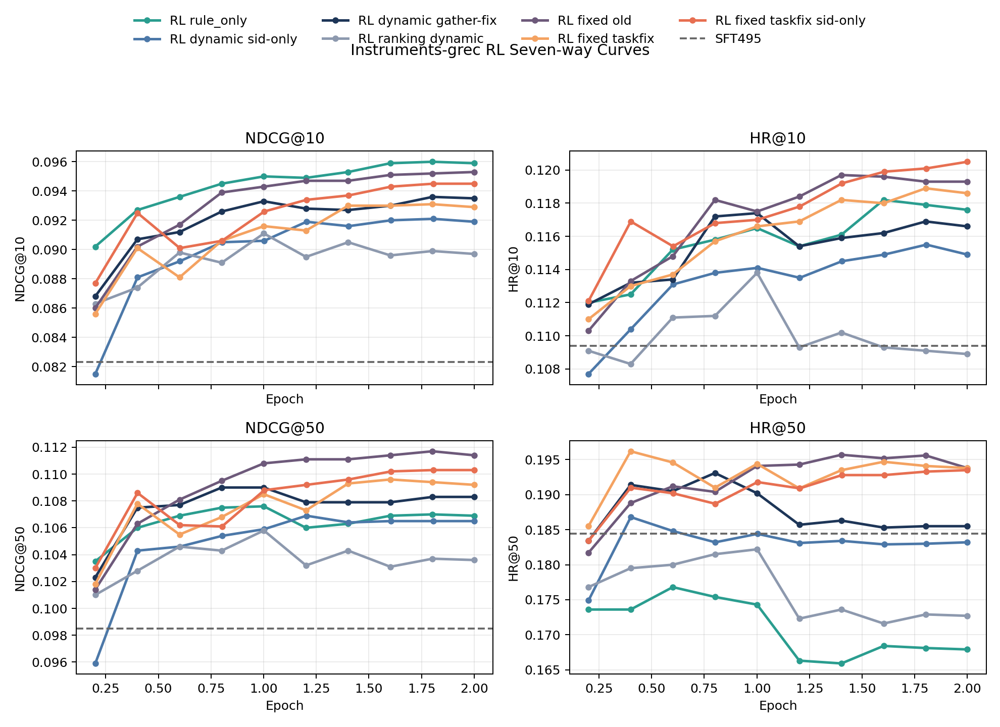
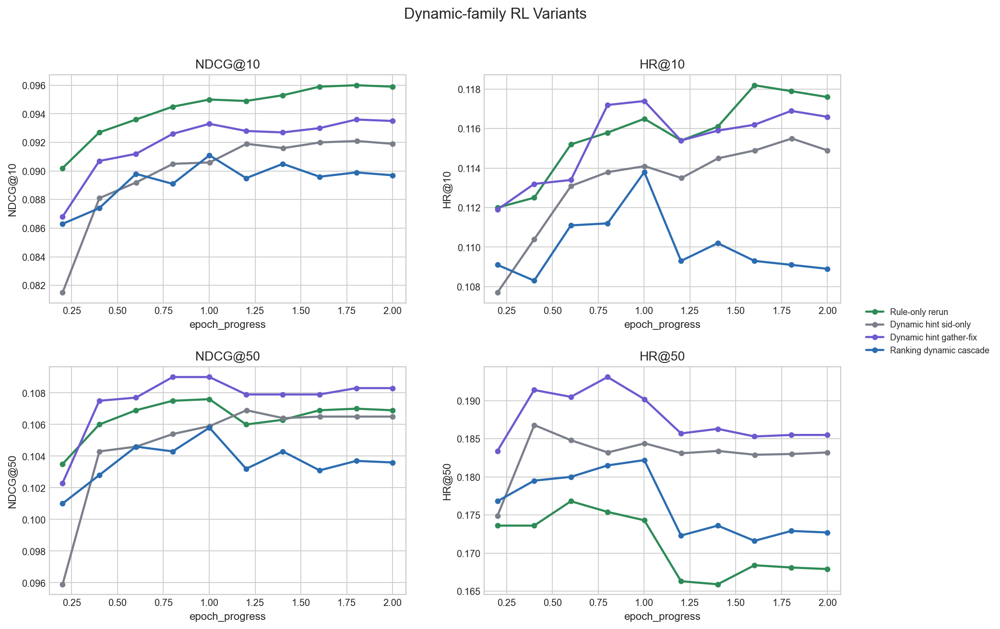
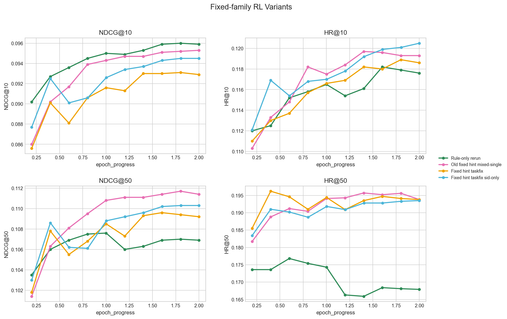
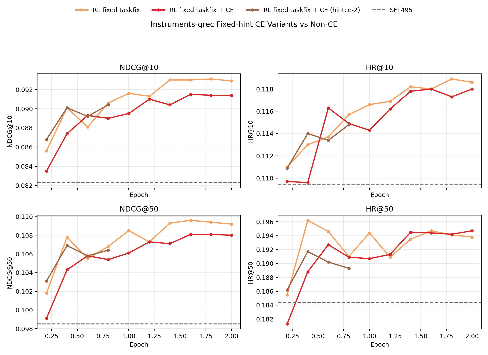
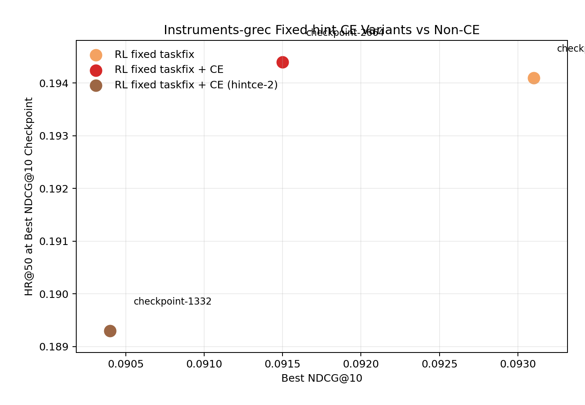
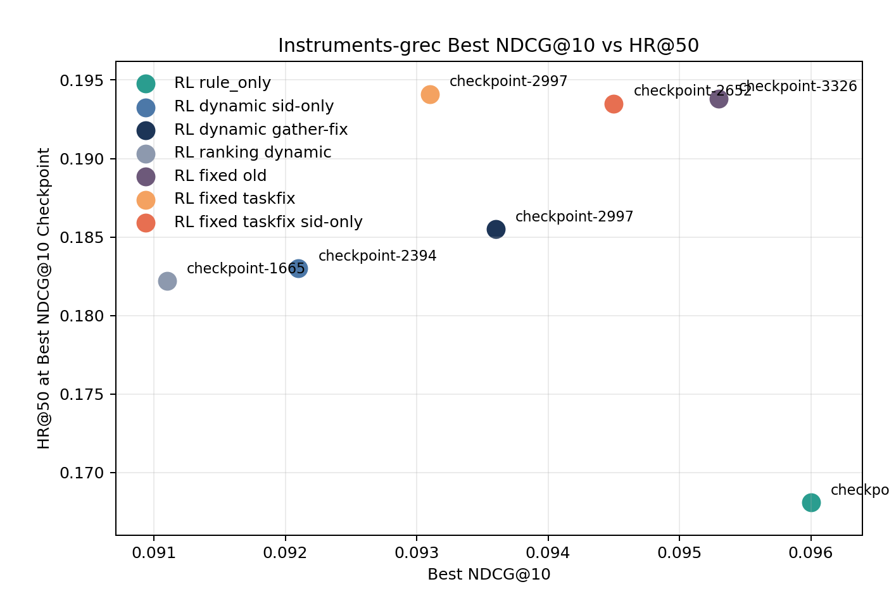

# GenRec Instruments RL 七线主比较 + fixed-hint CE 补充（2026-04-11）

- Record date: 2026-04-11
- Last updated: 2026-04-16
- Goal: 把当前 `Instruments-grec` 里最常被一起讨论的 7 条 RL 线放到同一篇文档里，用统一 checkpoint 评测表和统一图片做一次手工对比，重点看 top-10 与 coverage 的取舍；同时补一个 focused `fixed-hint CE` 小节。
- Current status: 已基于本地同步好的 `results/.../checkpoint-*/metrics.json` 重生七线对比图和导出表；`fixed taskfix` CE 小节现在纳入 non-CE、full `+CE` 和新的 `hintce-2` 短跑结果。

## 1. Config

- Dataset / split / task family:
  - `Instruments` / `grec`
  - 聚合评测口径仍然覆盖混合 RL 任务：`task1_sid_sft`、`task4_hisTitle2sid`、`task5_title_desc2sid`
- Base model / checkpoint:
  - `Qwen2.5-3B-Instruct`
  - RL 起点统一参考 `Instruments-grec-sft-qwen4B-4-256-dsz0/checkpoint-495`
- Hope scripts:
  - plain `rule_only`:
    [`Qwen2_5-3B-Isntruct-qwen4B-4-256-MIMIGenRec-grec-rl-rule-only.sh`](/Users/fanghaotian/Desktop/src/GenRec/hope/Qwen2_5-3B-Isntruct-qwen4B-4-256-MIMIGenRec-grec/Qwen2_5-3B-Isntruct-qwen4B-4-256-MIMIGenRec-grec-rl-rule-only.sh)
  - `dynamic hint sid-only`:
    [`Qwen2_5-3B-Isntruct-qwen4B-4-256-MIMIGenRec-grec-rl-rule-only-dynamic-hint-sid-only.sh`](/Users/fanghaotian/Desktop/src/GenRec/hope/Qwen2_5-3B-Isntruct-qwen4B-4-256-MIMIGenRec-grec/Qwen2_5-3B-Isntruct-qwen4B-4-256-MIMIGenRec-grec-rl-rule-only-dynamic-hint-sid-only.sh)
  - `dynamic hint gather-fix`:
    [`Qwen2_5-3B-Isntruct-qwen4B-4-256-MIMIGenRec-grec-rl-rule-only-dynamic-hint.sh`](/Users/fanghaotian/Desktop/src/GenRec/hope/Qwen2_5-3B-Isntruct-qwen4B-4-256-MIMIGenRec-grec/Qwen2_5-3B-Isntruct-qwen4B-4-256-MIMIGenRec-grec-rl-rule-only-dynamic-hint.sh)
  - `ranking dynamic cascade`:
    [`Qwen2_5-3B-Isntruct-qwen4B-4-256-MIMIGenRec-grec-rl-ranking-dynamic-hint.sh`](/Users/fanghaotian/Desktop/src/GenRec/hope/Qwen2_5-3B-Isntruct-qwen4B-4-256-MIMIGenRec-grec/Qwen2_5-3B-Isntruct-qwen4B-4-256-MIMIGenRec-grec-rl-ranking-dynamic-hint.sh)
  - corrected `fixed hint taskfix`:
    [`Qwen2_5-3B-Isntruct-qwen4B-4-256-MIMIGenRec-grec-rl-rule-only-fixed-hint.sh`](/Users/fanghaotian/Desktop/src/GenRec/hope/Qwen2_5-3B-Isntruct-qwen4B-4-256-MIMIGenRec-grec/Qwen2_5-3B-Isntruct-qwen4B-4-256-MIMIGenRec-grec-rl-rule-only-fixed-hint.sh)
  - corrected `fixed hint taskfix sid-only`:
    [`Qwen2_5-3B-Isntruct-qwen4B-4-256-MIMIGenRec-grec-rl-rule-only-fixed-hint-sid-only.sh`](/Users/fanghaotian/Desktop/src/GenRec/hope/Qwen2_5-3B-Isntruct-qwen4B-4-256-MIMIGenRec-grec/Qwen2_5-3B-Isntruct-qwen4B-4-256-MIMIGenRec-grec-rl-rule-only-fixed-hint-sid-only.sh)
  - corrected `fixed hint taskfix + CE`:
    [`Qwen2_5-3B-Isntruct-qwen4B-4-256-MIMIGenRec-grec-rl-rule-only-fixed-hint-ce.sh`](/Users/fanghaotian/Desktop/src/GenRec/hope/Qwen2_5-3B-Isntruct-qwen4B-4-256-MIMIGenRec-grec/Qwen2_5-3B-Isntruct-qwen4B-4-256-MIMIGenRec-grec-rl-rule-only-fixed-hint-ce.sh)
  - old `fixed hint mixed-single`:
    - 当前 `hope/` 树里已经没有单独保留一个 `mixed-single` launcher；现有 fixed-hint 脚本都已经切到 corrected `taskfix` 系列。
    - 本文把 old `mixed-single` 只当作历史结果参考线，不把它当作当前方法定义。
- Important overrides:
  - 统一进度轴：`epoch_progress = checkpoint_step / max_checkpoint_step * 2.0`
  - 主表默认按 `best NDCG@10 checkpoint` 选点；同时单独记录每条线的 `best HR@50 checkpoint`，用来识别 early coverage spike。
  - 七线主比较仍然只保留最常用的 7 条主线；CE 变体单独放在 CE 小节。

## 2. Result Paths

- Compared result dirs:
  - `results/Instruments-grec-grpo-rule-only-rerun-quietlog-qwen2.5-3b-qwen4B-4-256-from-sft495`
  - `results/Instruments-grec-grpo-rule-only-dynamic-hint-sid-only-qwen2.5-3b-qwen4B-4-256-from-sft495`
  - `results/Instruments-grec-grpo-rule-only-dynamic-hint-cascade-reward-gather-fix-qwen2.5-3b-qwen4B-4-256-from-sft495`
  - `results/Instruments-grec-grpo-ranking-dynamic-hint-cascade-qwen2.5-3b-qwen4B-4-256-from-sft495`
  - `results/Instruments-grec-grpo-rule-only-fixed-hint-mixed-single-generate-qwen2.5-3b-qwen4B-4-256-from-sft495`
  - `results/Instruments-grec-grpo-rule-only-fixedhint-taskfix-b16-sft495`
  - `results/Instruments-grec-grpo-rule-only-fixedhint-taskfix-b16-sid-only-sft495`
  - `results/Instruments-grec-grpo-rule-only-fixedhint-taskfix-b16-hintce-sft495`
  - `results/Instruments-grec-grpo-rule-only-fixedhint-taskfix-b16-hintce-2-sft495`
- SFT reference:
  - `results/Instruments-grec-sft-qwen4B-4-256-dsz0/checkpoint-495/metrics.json`
- Metric sources:
  - 各结果目录下的 `checkpoint-*/metrics.json`
- Derived comparison assets:
  - [`rl_variant_checkpoint_metrics.csv`](/Users/fanghaotian/Desktop/src/GenRec/docs/assets/2026-04-11-genrec-instruments-rl-variant-comparison/rl_variant_checkpoint_metrics.csv)
  - [`rl_variant_best_summary.csv`](/Users/fanghaotian/Desktop/src/GenRec/docs/assets/2026-04-11-genrec-instruments-rl-variant-comparison/rl_variant_best_summary.csv)
  - [`sft495_reference_metrics.csv`](/Users/fanghaotian/Desktop/src/GenRec/docs/assets/2026-04-11-genrec-instruments-rl-variant-comparison/sft495_reference_metrics.csv)
  - [`fixed_hint_ce_checkpoint_metrics.csv`](/Users/fanghaotian/Desktop/src/GenRec/docs/assets/2026-04-11-genrec-instruments-rl-variant-comparison/fixed_hint_ce_checkpoint_metrics.csv)
  - [`fixed_hint_ce_best_summary.csv`](/Users/fanghaotian/Desktop/src/GenRec/docs/assets/2026-04-11-genrec-instruments-rl-variant-comparison/fixed_hint_ce_best_summary.csv)

## 3. Key Metrics

### 3.1 按 `NDCG@10` 选 best checkpoint

| Variant | Best checkpoint | Best epoch | NDCG@10 | HR@10 | NDCG@50 | HR@50 | Notes |
| --- | --- | ---: | ---: | ---: | ---: | ---: | --- |
| `SFT495` reference | `checkpoint-495` | - | 0.0823 | 0.1094 | 0.0985 | 0.1844 | RL 对照基线 |
| `rule_only rerun` | `checkpoint-2997` | 1.802 | 0.0960 | 0.1179 | 0.1070 | 0.1681 | top-10 全场最好，但 coverage 最弱 |
| `dynamic hint sid-only` | `checkpoint-2394` | 1.805 | 0.0921 | 0.1155 | 0.1065 | 0.1830 | 比 plain `rule_only` 更平衡，但还没过 SFT `HR@50` |
| `dynamic hint gather-fix` | `checkpoint-2997` | 1.802 | 0.0936 | 0.1169 | 0.1083 | 0.1855 | 当前 dynamic family 最强 |
| `ranking dynamic cascade` | `checkpoint-1665` | 1.001 | 0.0911 | 0.1138 | 0.1058 | 0.1822 | 中期见顶，后期回落最明显 |
| old `fixed hint mixed-single` | `checkpoint-3326` | 2.000 | 0.0953 | 0.1193 | 0.1114 | 0.1938 | 历史参考上界，带 legacy bug |
| corrected `fixed hint taskfix` | `checkpoint-2997` | 1.802 | 0.0931 | 0.1189 | 0.1094 | 0.1941 | corrected 线里 `HR@50` 最高之一 |
| corrected `fixed hint taskfix sid-only` | `checkpoint-2652` | 2.000 | 0.0945 | 0.1205 | 0.1103 | 0.1935 | 与 old fixed 最接近的 clean 参考线 |

### 3.2 按 `HR@50` 看 coverage 峰值

| Variant | Peak checkpoint | Peak epoch | Peak HR@50 | NDCG@10 at peak | Notes |
| --- | --- | ---: | ---: | ---: | --- |
| `rule_only rerun` | `checkpoint-999` | 0.601 | 0.1768 | 0.0936 | 早期小峰值后一路掉到低于 SFT |
| `dynamic hint sid-only` | `checkpoint-532` | 0.401 | 0.1868 | 0.0881 | coverage 峰来得很早，后面没有继续抬高 |
| `dynamic hint gather-fix` | `checkpoint-1332` | 0.801 | 0.1931 | 0.0926 | 早中期 coverage 提升最明显 |
| `ranking dynamic cascade` | `checkpoint-1665` | 1.001 | 0.1822 | 0.0911 | 峰值本身就偏低 |
| old `fixed hint mixed-single` | `checkpoint-2331` | 1.402 | 0.1957 | 0.0947 | old fixed 的 coverage 参考峰值 |
| corrected `fixed hint taskfix` | `checkpoint-666` | 0.400 | 0.1962 | 0.0901 | 全表最高 `HR@50`，但属于早期 spike |
| corrected `fixed hint taskfix sid-only` | `checkpoint-2652` | 2.000 | 0.1935 | 0.0945 | 最稳的一条 corrected fixed 线 |

### 3.3 `fixed taskfix` 的 CE variants vs non-CE

| Variant | Best checkpoint | Best epoch | NDCG@10 | HR@10 | NDCG@50 | HR@50 | Peak HR@50 | Peak epoch | Readout |
| --- | --- | ---: | ---: | ---: | ---: | ---: | ---: | ---: | --- |
| corrected `fixed taskfix` | `checkpoint-2997` | 1.802 | 0.0931 | 0.1189 | 0.1094 | 0.1941 | 0.1962 | 0.400 | top-10 最强，但 early coverage spike 最明显 |
| corrected `fixed taskfix + CE` | `checkpoint-2664` | 1.602 | 0.0915 | 0.1180 | 0.1081 | 0.1944 | 0.1947 | 2.000 | top-10 略弱，但 coverage 被拉成晚期平台 |
| corrected `fixed taskfix + CE (hintce-2)` | `checkpoint-1332` | 0.801 | 0.0904 | 0.1148 | 0.1064 | 0.1893 | 0.1917 | 0.400 | 目前只跑到 `1332/3326`，仍是 early-run readout |

这里要单独说明两点：

- `hintce-2` 目前只有 `checkpoint-333/666/999/1332` 四个点，但它的 epoch 口径现在按 fixed family 的完整训练步数 `3326` 对齐，所以 `checkpoint-1332` 只对应 `epoch≈0.801`，`checkpoint-666` 的 coverage 峰值也只对应 `epoch≈0.400`。
- full `+CE` 的 peak `HR@50` 现在应记为 `0.1947 @ checkpoint-3326`。之前把它写成 `0.1945 @ checkpoint-2331` 只是一个较早读数，不是当前同步结果里的最终峰值。

如果只看三条线共享的 `333/666/999/1332` 四个 checkpoint，可以得到更细的 early-train readout：

- `hintce-2` 相对 full `+CE` 的 `NDCG@10` 差值依次是 `+0.0033`、`+0.0027`、`-0.0001`、`+0.0014`，说明它在早期 top-10 恢复更快。
- 但 `HR@50` 只在 `333/666` 领先 full `+CE`（`+0.0049`、`+0.0029`），到了 `999/1332` 反而落后（`-0.0025`、`-0.0016`）。
- 因此当前更合理的解释不是“`hintce-2` 已经赢了 full `+CE`”，而是“它像一个更激进的 early-train CE 变体，起量更快，但 late coverage 平台还没有证据超过 full `+CE`。”

## 4. Manual Picture Comparison

### 4.1 七线总览

- [`rl-seven-way-main-curves.png`](/Users/fanghaotian/Desktop/src/GenRec/docs/assets/2026-04-11-genrec-instruments-rl-variant-comparison/rl-seven-way-main-curves.png)

手工看图后的结论：

- `rule_only rerun` 最典型地体现了“top-10 换 coverage”：`NDCG@10` 一直涨到最右侧，但 `HR@50` 在 `epoch≈0.6` 之后明显往下掉，最后落到 `0.1679`。
- 三条 fixed family 主线在 `NDCG@50 / HR@50` 面板里整体都压在最上方。hint scaffold 的主要收益仍然是 coverage 侧，而不是某一个偶然的 top-10 点。
- `ranking dynamic cascade` 在四个面板里都没有占到上风：中期一度接近 `dynamic sid-only`，但后期是唯一一条在 `NDCG@10` 和 `HR@50` 都明显回撤的 dynamic 线。

### 4.2 Dynamic Family

- [`rl-dynamic-family-curves.png`](/Users/fanghaotian/Desktop/src/GenRec/docs/assets/2026-04-11-genrec-instruments-rl-variant-comparison/rl-dynamic-family-curves.png)

最有用的读法：

- `dynamic gather-fix` 仍然是当前长跑 dynamic family 的 canonical baseline。按各自 best `NDCG@10` 点比较，它比 `dynamic sid-only` 多 `+0.0015` `NDCG@10`、`+0.0018` `NDCG@50`、`+0.0025` `HR@50`。
- 和 `ranking dynamic cascade` 比，`dynamic gather-fix` 的优势更干净：`+0.0025` `NDCG@10`、`+0.0031` `HR@10`、`+0.0025` `NDCG@50`、`+0.0033` `HR@50`。
- `dynamic sid-only` 的问题不是完全没收益，而是峰值来得太早：`HR@50` 在 `epoch≈0.4` 就到 `0.1868`，后面基本只是在更高 `NDCG@10` 和更低 coverage 之间做交换。
- `ranking dynamic cascade` 更像“中期见顶，后期失速”：最佳点停在 `epoch≈1.0`，最后收尾只剩 `NDCG@10=0.0897`、`HR@50=0.1727`。

### 4.3 Fixed Family

- [`rl-fixed-family-curves.png`](/Users/fanghaotian/Desktop/src/GenRec/docs/assets/2026-04-11-genrec-instruments-rl-variant-comparison/rl-fixed-family-curves.png)

这张图对应的判断更细一点：

- corrected `fixed hint taskfix sid-only` 到训练后半程已经和 old `fixed hint mixed-single` 很接近。按各自 best `NDCG@10` 点对比，它只差 `-0.0008` `NDCG@10`、`-0.0011` `NDCG@50`、`-0.0003` `HR@50`，但 `HR@10` 还高 `+0.0012`。
- corrected `fixed hint taskfix` 的图像特征仍然很鲜明：`HR@50` 在 `epoch≈0.4` 直接冲到全表最高 `0.1962`，但那个点的 `NDCG@10` 只有 `0.0901`。这更像一个 coverage early spike，不适合直接拿来当 balanced headline。
- old `fixed hint mixed-single` 仍然是 coverage 最顺、最平滑的历史参考线，但它的解释必须保留 bug caveat；如果主文档只想留 clean 参考线，更适合用 corrected `taskfix sid-only` 代替它。

### 4.4 `fixed taskfix` CE variants vs non-CE

- [`rl-fixed-taskfix-ce-vs-nonce-curves.png`](/Users/fanghaotian/Desktop/src/GenRec/docs/assets/2026-04-11-genrec-instruments-rl-variant-comparison/rl-fixed-taskfix-ce-vs-nonce-curves.png)

- [`rl-fixed-taskfix-ce-vs-nonce-scatter.png`](/Users/fanghaotian/Desktop/src/GenRec/docs/assets/2026-04-11-genrec-instruments-rl-variant-comparison/rl-fixed-taskfix-ce-vs-nonce-scatter.png)

这两张图现在更适合读成“三线对比”，而不是单纯的 `+CE` / non-CE 二选一：

- non-CE `fixed taskfix` 依然是更强的 headline top-10 线：best 点停在 `checkpoint-2997 / NDCG@10=0.0931`，并且在后半程 `NDCG@10` 与 `HR@10` 仍保持领先。
- full `+CE` 没有把 peak coverage 推得更高，但明显把轨迹变平了。它没有 non-CE 那种 `epoch≈0.4` 的巨大 early spike，而是一路推到最右侧，最后形成 `HR@50≈0.1944~0.1947` 的晚期平台。
- `hintce-2` 落在两者之间。它在 `333/666` 两个共享点同时优于 full `+CE` 的 top-10 和 coverage，更像一个更激进的 early-train 版本；但到 `1332` 时，`NDCG@10` 仍然低于 non-CE，`HR@50` 也略低于 full `+CE`。
- 因为 `hintce-2` trace 只到 `1332`，当前图最该读的是“它的早期曲线形状”，而不是“它已经赢下最终设置”。在没有 `1665/1998/2664/3326` 后续点之前，不应该把它直接升成新的 CE 默认线。

### 4.5 Top-10 / Coverage Trade-off Scatter

- [`rl-best-ndcg10-vs-hr50-scatter.png`](/Users/fanghaotian/Desktop/src/GenRec/docs/assets/2026-04-11-genrec-instruments-rl-variant-comparison/rl-best-ndcg10-vs-hr50-scatter.png)

这张散点图把主故事压缩得最清楚：

- 最右边但最低的是 `rule_only`。plain exact reward 的确能把 top-10 打到最好，但 coverage 代价非常明确。
- 左上角和右上角主要被 fixed family 占据。按“每条线自己的 best `NDCG@10` 点”来看，真正站在 top-right 区域的是 old `fixed`、corrected `fixed taskfix` 和 corrected `fixed taskfix sid-only`。
- 在 dynamic family 里，`dynamic gather-fix` 仍然是长期 default；它是唯一一个在 best `NDCG@10` 点还能把 `HR@50` 拉到 SFT495 水平之上的长跑 dynamic run。

## 5. Conclusions

1. 如果只按 `NDCG@10` 排名，`rule_only rerun` 仍然是第一，`NDCG@10=0.0960`。但它在相同 checkpoint 的 `HR@50=0.1681`，比 `SFT495` 低 `0.0163`，因此它只能当 top-10 极值线，不能当“最平衡”主线。
2. 在 dynamic family 里，`dynamic gather-fix` 仍应作为当前长跑默认对比线。它相对 `dynamic sid-only` 和 `ranking dynamic` 都是四指标同时更强的。
3. 在 fixed family 里，corrected `fixed hint taskfix sid-only` 已经基本复现 old `fixed mixed-single` 的主要收益，而且定义更干净。后续如果只保留一个 clean fixed 参考线，优先保留它。
4. corrected `fixed hint taskfix` 给出了当前最高的 coverage 峰值 `HR@50=0.1962`。如果后续要研究 early-stop 或 explicit coverage objective，这条线仍然值得单独盯。
5. full `+CE` 现在更像一个“平滑训练轨迹”的正则项，而不是提升 headline 指标的增强项。它把 early spike 拉成了晚期 coverage 平台，但没有在 top-10 上超过 non-CE。
6. `hintce-2` 是一个值得继续的 early-train 变体，但当前证据只够支持“起量更快”，还不够支持“最终更好”。在没有更长 trace 之前，它不该替代 full `+CE` 进入主结论。
7. old `fixed hint mixed-single` 仍然是很有价值的现象学上界，但它不适合再被当作“更正确的方法”。在公开汇报或主结论里，最好把它标成 historical / bug-tainted reference。

## 6. Next Actions

1. 下一版主结果对比可以收缩成 4 条主线：`rule_only rerun`、`dynamic gather-fix`、corrected `fixed taskfix sid-only`、old `fixed mixed-single`（只作为 historical reference）。
2. 如果目标是 coverage，不要只看最终 checkpoint；应该补更密的 early-stop 评测，优先围绕 corrected `fixed taskfix` 的 `checkpoint-666` 和 `dynamic gather-fix` 的 `checkpoint-1332`。
3. 如果继续追 CE 方向，优先不是再加新命名，而是把 `hintce-2` 跑到至少 `2664/3326`，先看它会不会真的收敛到比 full `+CE` 更好的 late platform。
4. 如果后续要对任务层面下结论，应该把这些主线再按 `task1_sid_sft`、`task4_hisTitle2sid`、`task5_title_desc2sid` 分开看。当前这篇 note 只覆盖 aggregate eval，不足以单独支持 task-level 结论，尤其 old fixed 的 bug 主要会扭曲 hardest task 的 hint 深度。
