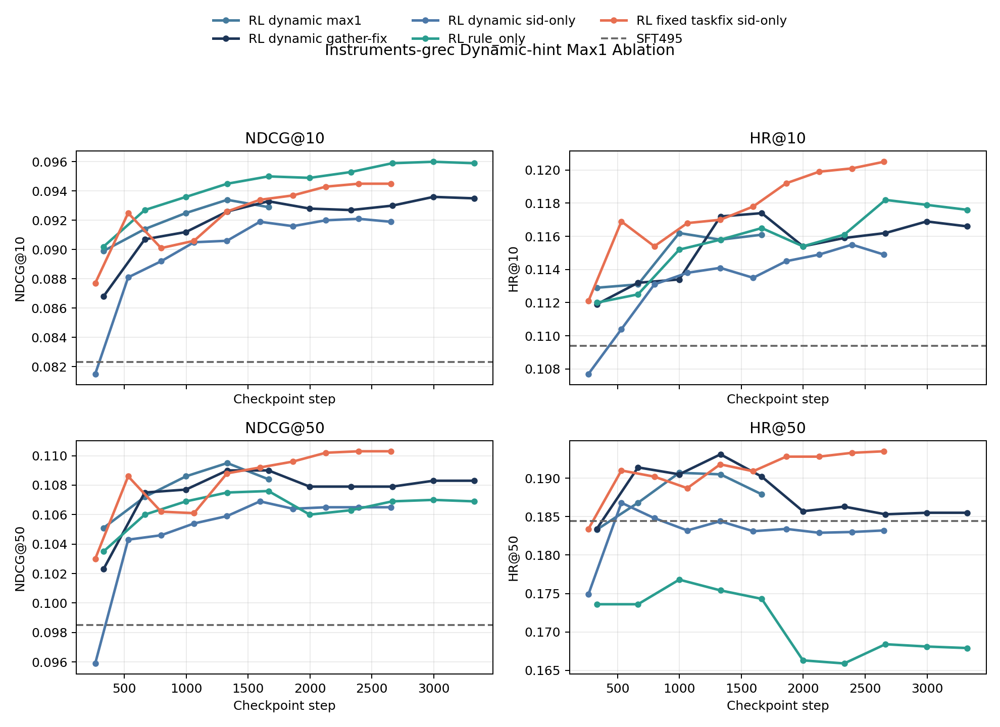
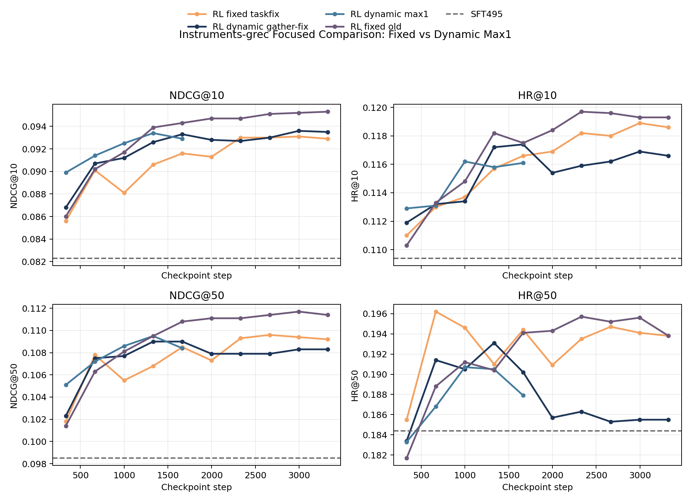

# Instruments Dynamic-Hint Max1 消融结果（2026-04-16）

- Record date: 2026-04-16
- Last updated: 2026-04-16
- Status: 已同步 `max1` 结果并完成基于 `checkpoint-*/metrics.json` 的首轮分析；当前只同步到 `checkpoint-1665`，按与长跑 dynamic 线一致的 `3326 step = 2 epoch` 口径，这大约是 `epoch≈1.001`。训练日志和 train-time 标量还没一起同步回来，所以这篇 note 目前只覆盖 eval 侧证据。
- Goal: 在 `Instruments-grec` 上做一个最小改动的 `dynamic hint` 消融，只把 online hint budget 从 `<=3` 收紧到 `<=1`，不改 trainer 逻辑，不引入 no-hit 样本丢弃，然后看它和现有 dynamic / no-hint / fixed-hint 参考线相比到底落在什么位置。

## 1. 这次实验到底改了什么

这次实验只改一件事：

- 把 `dynamic_hint_max_depth` 从 `3` 改成 `1`

明确不改的部分：

- 不改 `reward_mode`，仍然是 `rule_only`
- 不改 `num_beams`，仍然是 `16`
- 不改 dataset variant，仍然是 `Instruments_grec_index_emb-qwen3-embedding-4B_rq4_cb256-256-256-256_dsInstruments_ridFeb-10-2026-05-40-47`
- 不改 trainer 的 stage 收口逻辑
- 不做“给了 1 个 hint 还没 hit 就丢数据”的筛除

所以这次实验验证的是：

> 如果只允许 `dynamic hint` 最多暴露 1 个 oracle token，而不是最多 3 个，最终的 eval trade-off 会怎么变。

它目前还不验证：

> “给了 1 个 hint 后还没 hit 的样本是否应当被 drop”

后者如果要做，必须改 trainer，而这次没有做。

## 2. 对应脚本与结果资产

- Launcher:
  [Qwen2_5-3B-Isntruct-qwen4B-4-256-MIMIGenRec-grec-rl-rule-only-dynamic-hint-max1.sh](/Users/fanghaotian/Desktop/src/GenRec/hope/Qwen2_5-3B-Isntruct-qwen4B-4-256-MIMIGenRec-grec/Qwen2_5-3B-Isntruct-qwen4B-4-256-MIMIGenRec-grec-rl-rule-only-dynamic-hint-max1.sh)
- 参考原始 dynamic-hint gather-fix launcher:
  [Qwen2_5-3B-Isntruct-qwen4B-4-256-MIMIGenRec-grec-rl-rule-only-dynamic-hint.sh](/Users/fanghaotian/Desktop/src/GenRec/hope/Qwen2_5-3B-Isntruct-qwen4B-4-256-MIMIGenRec-grec/Qwen2_5-3B-Isntruct-qwen4B-4-256-MIMIGenRec-grec-rl-rule-only-dynamic-hint.sh)

本次文档直接使用的 result dirs：

- `results/Instruments-grec-grpo-rule-only-dynamic-hint-max1-qwen2.5-3b-qwen4B-4-256-from-sft495`
- `results/Instruments-grec-grpo-rule-only-dynamic-hint-cascade-reward-gather-fix-qwen2.5-3b-qwen4B-4-256-from-sft495`
- `results/Instruments-grec-grpo-rule-only-dynamic-hint-sid-only-qwen2.5-3b-qwen4B-4-256-from-sft495`
- `results/Instruments-grec-grpo-rule-only-rerun-quietlog-qwen2.5-3b-qwen4B-4-256-from-sft495`
- `results/Instruments-grec-grpo-rule-only-fixedhint-taskfix-b16-sid-only-sft495`
- `results/Instruments-grec-sft-qwen4B-4-256-dsz0/checkpoint-495`

这次新生成的分析资产：

- [`max1_ablation_checkpoint_metrics.csv`](/Users/fanghaotian/Desktop/src/GenRec/docs/assets/2026-04-16-instruments-dynamic-hint-max1-ablation/max1_ablation_checkpoint_metrics.csv)
- [`max1_ablation_best_summary.csv`](/Users/fanghaotian/Desktop/src/GenRec/docs/assets/2026-04-16-instruments-dynamic-hint-max1-ablation/max1_ablation_best_summary.csv)
- [`max1-ablation-step-curves.png`](/Users/fanghaotian/Desktop/src/GenRec/docs/assets/2026-04-16-instruments-dynamic-hint-max1-ablation/max1-ablation-step-curves.png)
- [`max1-vs-fixed-step-curves.png`](/Users/fanghaotian/Desktop/src/GenRec/docs/assets/2026-04-16-instruments-dynamic-hint-max1-ablation/max1-vs-fixed-step-curves.png)

这里刻意把图的横轴画成了 `checkpoint step`，而不是每条 run 内部归一化后的 epoch。原因很简单：`max1` 当前只同步到 `checkpoint-1665`，如果继续用“每条 run 自己归一化到 2.0”的轴，会把这个短 trace 伪装成和 `3326` 步 run 一样长。

这篇 note 里的 epoch 口径分两类：

- `max1`、`dynamic gather-fix`、`rule_only rerun`、corrected `fixed taskfix`、old `fixed` 都按 `3326 step = 2 epoch`
- `dynamic sid-only` 和 corrected `fixed taskfix sid-only` 按它们自己的完整训练长度 `2652 step = 2 epoch`

也就是说，`sid-only` checkpoint 更少是因为它的 step horizon 本来就更短，不是因为它只跑到一半。

## 3. Key Metrics

### 3.1 按 `NDCG@10` 选 best checkpoint

| Variant | Best checkpoint | Best epoch | NDCG@10 | HR@10 | NDCG@50 | HR@50 | Readout |
| --- | --- | ---: | ---: | ---: | ---: | ---: | --- |
| `SFT495` reference | `checkpoint-495` | - | 0.0823 | 0.1094 | 0.0985 | 0.1844 | 评测对照基线 |
| `rule_only rerun` | `checkpoint-2997` | 1.802 | 0.0960 | 0.1179 | 0.1070 | 0.1681 | top-10 极值线，但 coverage 很低 |
| `dynamic hint sid-only` | `checkpoint-2394` | 1.805 | 0.0921 | 0.1155 | 0.1065 | 0.1830 | 早期有 gain，后面偏平 |
| `dynamic hint gather-fix` | `checkpoint-2997` | 1.802 | 0.0936 | 0.1169 | 0.1083 | 0.1855 | 当前长跑 dynamic baseline |
| `dynamic hint max1` | `checkpoint-1332` | 0.801 | 0.0934 | 0.1158 | 0.1095 | 0.1905 | 还没跑满 2 epoch，但 top-10 已几乎追平 gather-fix |
| corrected `fixed taskfix sid-only` | `checkpoint-2652` | 2.000 | 0.0945 | 0.1205 | 0.1103 | 0.1935 | 当前 clean hint 上界参考 |

按各自 best `NDCG@10` 点比较，`max1` 的关键差值是：

- 相比 `dynamic gather-fix`：`NDCG@10 -0.0002`、`HR@10 -0.0011`、`NDCG@50 +0.0012`、`HR@50 +0.0050`
- 相比 `rule_only rerun`：`NDCG@10 -0.0026`、`HR@10 -0.0021`、`NDCG@50 +0.0025`、`HR@50 +0.0224`
- 相比 corrected `fixed taskfix sid-only`：`NDCG@10 -0.0011`、`HR@10 -0.0047`、`NDCG@50 -0.0008`、`HR@50 -0.0030`

这基本说明 `max1` 不是“退化成 plain `rule_only`”，而是把 dynamic family 明显往 fixed-like coverage 方向推了一步。

### 3.2 按 `HR@50` 看 coverage 峰值

| Variant | Peak checkpoint | Peak epoch | Peak HR@50 | NDCG@10 at peak | Readout |
| --- | --- | ---: | ---: | ---: | --- |
| `rule_only rerun` | `checkpoint-999` | 0.601 | 0.1768 | 0.0936 | coverage 峰值低，而且很早就掉下去 |
| `dynamic hint sid-only` | `checkpoint-532` | 0.401 | 0.1868 | 0.0881 | 典型 early spike |
| `dynamic hint gather-fix` | `checkpoint-1332` | 0.801 | 0.1931 | 0.0926 | 当前长跑 dynamic 的 coverage 峰值 |
| `dynamic hint max1` | `checkpoint-999` | 0.601 | 0.1907 | 0.0925 | peak coverage 略低于 gather-fix，但高于 sid-only 和 rule_only |
| corrected `fixed taskfix sid-only` | `checkpoint-2652` | 2.000 | 0.1935 | 0.0945 | 仍然是更强的 clean hint 参考 |

如果只看 coverage 峰值，`max1` 还没有超过 `dynamic gather-fix`，差 `0.0024` `HR@50`。但它比 `dynamic sid-only` 高 `0.0039`，比 `rule_only rerun` 高 `0.0139`，因此至少可以确认它不是“hint budget 收紧后 coverage 直接塌掉”的失败 run。更重要的是，这个 peak 发生在 `epoch≈0.601`，也就是它离完整 2 epoch 还早。

### 3.3 共享 checkpoint 的 step-matched readout

最值得看的其实不是只有各自的 best 点，而是 `max1` 和两条主要 baseline 在共享 checkpoint 上的实际交换关系：

| Step | `max1` (`NDCG@10 / HR@50`) | `gather-fix` (`NDCG@10 / HR@50`) | `rule_only` (`NDCG@10 / HR@50`) |
| --- | --- | --- | --- |
| `333` | `0.0899 / 0.1833` | `0.0868 / 0.1834` | `0.0902 / 0.1736` |
| `666` | `0.0914 / 0.1868` | `0.0907 / 0.1914` | `0.0927 / 0.1736` |
| `999` | `0.0925 / 0.1907` | `0.0912 / 0.1905` | `0.0936 / 0.1768` |
| `1332` | `0.0934 / 0.1905` | `0.0926 / 0.1931` | `0.0945 / 0.1754` |
| `1665` | `0.0929 / 0.1879` | `0.0933 / 0.1902` | `0.0950 / 0.1743` |

从这张表里可以读出三个更细的现象：

- `max1` 在 very early 到 mid phase 不是保守的。它在 `333`（约 `epoch≈0.200`）时就比 `gather-fix` 多 `+0.0031` `NDCG@10`，而 `HR@50` 基本持平。
- 到 `999` 时，`max1` 已经实现了比 `gather-fix` 更高的 `NDCG@10`，同时 `HR@50` 还略高 `+0.0002`。这说明“浅 hint budget 不一定只能换来更像 `rule_only` 的曲线”，它也可能把 dynamic family 重新推到更好的平衡区。
- 但 `1665` 这个点提醒我们别过早下结论：按参考口径它只到 `epoch≈1.001`，此时 `gather-fix` 又在四指标上略微反超 `max1`。所以当前更准确的描述是“`max1` 前中期很强”，而不是“它已经无条件支配 `gather-fix`。”

## 4. Figure

- [`max1-ablation-step-curves.png`](/Users/fanghaotian/Desktop/src/GenRec/docs/assets/2026-04-16-instruments-dynamic-hint-max1-ablation/max1-ablation-step-curves.png)

这张图最重要的读法是：

- `max1` 明显不是简单退化成 `rule_only`。两条线在 `NDCG@10` 上确实更接近了，但 `max1` 的 `HR@50` 始终高得多，尤其在 `999~1665` 区间一直维持在 `0.188~0.191`，而 `rule_only` 只有 `0.174~0.177`。
- `max1` 也不是单纯被现有 dynamic baseline 支配。它在 `333/999/1332` 这几个关键点上都能给出比 `gather-fix` 更高的 `NDCG@10`，而 coverage 只在 `666/1332/1665` 这些点略输。
- 但 `max1` 目前还没有把 fixed-hint upper bound 打穿。corrected `fixed taskfix sid-only` 仍然在四个面板里整体压在更右上侧，说明 “把 dynamic budget 收浅” 和 “直接给更稳定的 fixed hint scaffold” 还是两件事。
- 由于 `max1` 只同步到 `1665`（约 `epoch≈1.001`），图上真正该读的是“它到中段为止的曲线形状”。如果后面继续跑到 `1998/2331/2664/2997/3326`，它是会像 `gather-fix` 一样继续稳住，还是会像某些 early-strong run 一样回落，现在还不能仅凭这张图决定。

### 4.2 Focused Four-way Comparison

- [`max1-vs-fixed-step-curves.png`](/Users/fanghaotian/Desktop/src/GenRec/docs/assets/2026-04-16-instruments-dynamic-hint-max1-ablation/max1-vs-fixed-step-curves.png)

这张四线图只保留 `fixed taskfix`、old `fixed`、`dynamic gather-fix` 和 `max1`，更适合回答“`max1` 到底是在追哪一类行为”：

- `max1` 和 `dynamic gather-fix` 仍然是最接近的一对。两条 dynamic 线在 `333~1665` 的大部分区间都缠得很紧，说明 `max1` 不是跳到了完全不同的方法族。
- 但 `max1` 在 `NDCG@50 / HR@50` 上明显更往 fixed family 靠。尤其在 `999/1332` 这两个点，它已经把 coverage 拉到接近 corrected `fixed taskfix` 的区间，而 `dynamic gather-fix` 还要再低一些。
- corrected `fixed taskfix` 依旧保留了最强的 coverage spike，old `fixed` 则给出更平的历史高位平台。把这两条线放进来之后，可以更清楚地看到：`max1` 目前更像是在 dynamic family 内部向 fixed trade-off 靠拢，而不是已经真正进入 fixed family 的 top-right 区域。
- 这也是为什么我现在更愿意把 `max1` 叫作“最有希望的 shallow-budget dynamic”，而不是直接叫它新的 fixed 替代品。

## 5. Conclusions

1. `max1` 当前可以算是最有希望的 shallow-budget dynamic 变体。按 best-point 看，它几乎追平 `dynamic gather-fix` 的 top-10，但把 `HR@50` 提高了 `+0.0050`。
2. 相比 `rule_only rerun`，`max1` 很明确地买回了 coverage，而且代价没有想象中大。它只丢了 `0.0026` `NDCG@10`，却多了 `0.0224` `HR@50`。
3. `max1` 还没有超过 corrected `fixed taskfix sid-only` 这条 clean fixed 参考线，所以当前更稳妥的定位不是“新最优方法”，而是“当前 dynamic family 里最接近 fixed trade-off 的候选”。
4. 现在最该防的误读是把这条 run 直接定性成“已经优于 gather-fix”。更严谨的说法是：它在 `333~1332`（约 `epoch≈0.200~0.801`）的前中期表现非常强，但到 `1665`（约 `epoch≈1.001`）时 `gather-fix` 又稍微拿回了优势。
5. 因为 train-time 日志还没同步回来，这篇 note 只能支持 eval-side 结论。`selected_hint_depth_mean`、`selected_depth_1_frac`、`mean_length` 等机制解释现在仍然是待验证假说，不应该写成已经被日志证实。

## 6. Next Actions

1. 把 `max1` 对应的 launcher log 或 wandb 导出一起同步回来，优先验证 `dynamic_hint_max_depth=1`、`selected_hint_depth_mean`、`selected_depth_1_frac`、`max_depth_miss_frac` 和 `completions/mean_length`。
2. 如果这条 run 还在继续，优先补到 `1998/2331/2664/2997/3326`。当前真正缺的不是更多 baseline，而是 `max1` 自己的 late-stage trace。
3. 如果后续要给 dynamic family 选默认线，我会先把 `max1` 和 `gather-fix` 做一次 task-level 对照，尤其看 hardest slice 是否仍然保住 coverage。
4. 如果后续要做更激进的 budget 实验，下一步更合理的是围绕 `max1` 补 trainer-side diagnostics，而不是直接跳到“hint1 miss 就丢样本”的更大改动。
