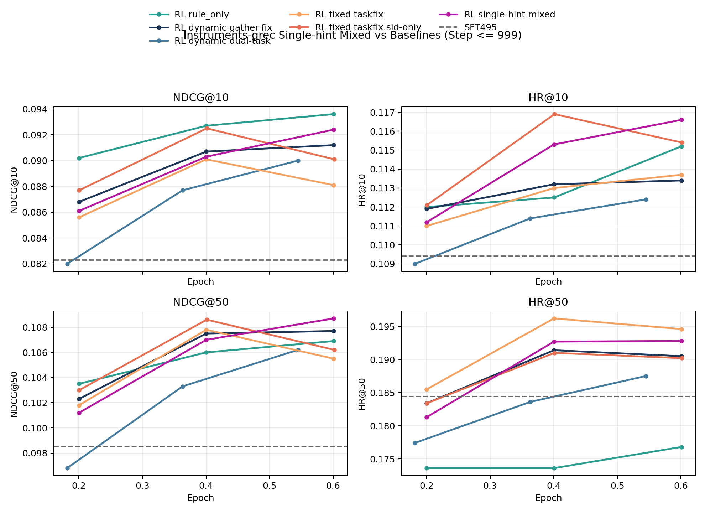
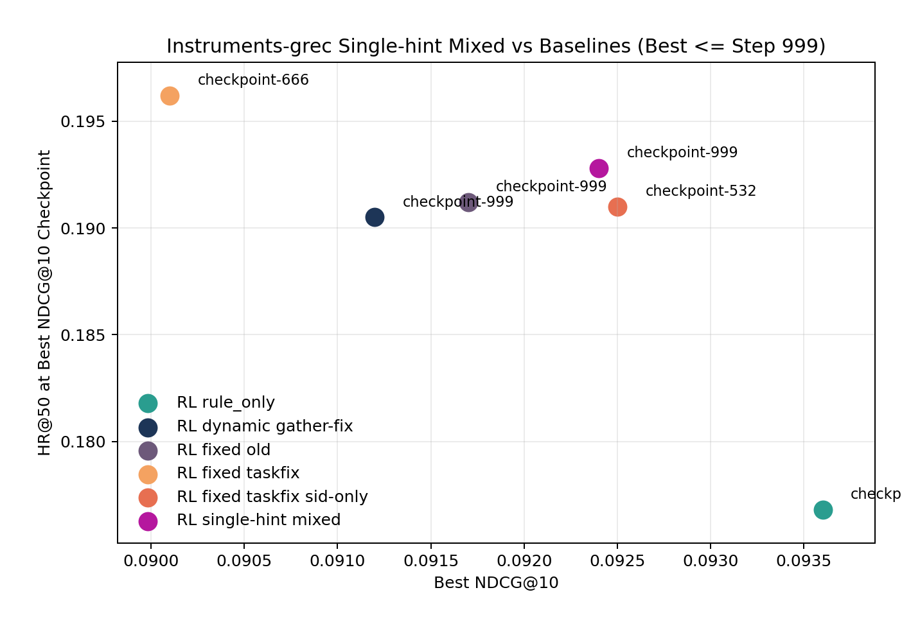

# 2026-04-19 Instruments 双任务过滤 / 单任务 Hint 训练跟踪

- 记录日期：2026-04-19
- 最后更新：2026-04-20
- 目标：把这轮 `Instruments-grec` 新开的两种训练 setting 记成一份可持续续写的 tracking note，并对齐当前本地 `results/` 同步状态。
- 当前状态：`bash scripts/sync_results_from_remote.sh unpack` 已在本地完成；当前本地 `results/` 快照里，`single-hint mixed` 只同步到 `checkpoint-999`，两条 `dual-task sid+title_desc` 线都还没有出现在当前 `results/` / manifest 快照里。

## 1. 这次在跟踪哪两种 setting

这轮实际有 3 个 launcher，但只对应 2 种研究问题：

1. 只训练两个任务：
   从 mixed RL 任务里移除 `task4_hisTitle2sid`，只保留 `task1_sid_sft + task5_title_desc2sid` 做 train，eval 仍只看 `task1_sid_sft`。
2. 只 hint 一个任务：
   训练时仍保留 mixed RL 三任务，但 fixed hint 只注入 `task1_sid_sft`，`task4/task5` 强制 zero-hint。

## 2. Setting 一览

### 2.1 只训练两个任务：`task1_sid_sft + task5_title_desc2sid`

两条 launcher 共享同一套基础超参：

- base checkpoint：`saves/qwen2.5-3b/full/Instruments-grec-sft-qwen4B-4-256-dsz0/checkpoint-495`
- data variant：`Instruments_grec_index_emb-qwen3-embedding-4B_rq4_cb256-256-256-256_dsInstruments_ridFeb-10-2026-05-40-47`
- reward：`rule_only`
- `num_beams=16`
- `train/eval batch size=64/64`
- `grad_acc=4`
- `epochs=2`
- `lr=1e-5`
- `eval_step=100`
- `max_completion_length=128`
- `beta=1e-3`
- `temperature=1.0`
- `eval_task_names=task1_sid_sft`

#### A. Dynamic hint dual-task

- hope 脚本：
  `hope/Qwen2_5-3B-Isntruct-qwen4B-4-256-MIMIGenRec-grec/Qwen2_5-3B-Isntruct-qwen4B-4-256-MIMIGenRec-grec-rl-rule-only-dynamic-hint-sid-title-desc.sh`
- 默认 train task：
  `task1_sid_sft,task5_title_desc2sid`
- dynamic hint 设定：
  `dynamic_hint_max_depth=3`
- eval 设定：
  `dynamic_hint_apply_to_eval=false`
- 预期训练输出目录：
  `rl_outputs/Instruments-grec-grpo-rule-only-dynamic-hint-sid-title-desc-qwen2.5-3b-qwen4B-4-256-from-sft495`
- 预期结果目录：
  `results/Instruments-grec-grpo-rule-only-dynamic-hint-sid-title-desc-qwen2.5-3b-qwen4B-4-256-from-sft495`

#### B. Fixed hint dual-task

- hope 脚本：
  `hope/Qwen2_5-3B-Isntruct-qwen4B-4-256-MIMIGenRec-grec/Qwen2_5-3B-Isntruct-qwen4B-4-256-MIMIGenRec-grec-rl-rule-only-fixed-hint-sid-title-desc.sh`
- 默认 train task：
  `task1_sid_sft,task5_title_desc2sid`
- beam hint analysis task：
  默认就是 train subset，也就是 `task1_sid_sft,task5_title_desc2sid`
- fixed hint export：
  先在 `temp/rl_beam_hint/` 下生成 dual-task 对应的 `summary/details`，再导出本轮专属的 fixed hint map
- eval 设定：
  `fixed_hint_apply_to_eval=false`
- 预期训练输出目录：
  `rl_outputs/Instruments-grec-grpo-rule-only-fixedhint-taskfix-b16-sid-title-desc-sft495`
- 预期结果目录：
  `results/Instruments-grec-grpo-rule-only-fixedhint-taskfix-b16-sid-title-desc-sft495`

### 2.2 只 hint 一个任务：mixed-task + fixed hint on `task1`

- hope 脚本：
  `hope/Qwen2_5-3B-Isntruct-qwen4B-4-256-MIMIGenRec-grec/Qwen2_5-3B-Isntruct-qwen4B-4-256-MIMIGenRec-grec-rl-rule-only-fixed-hint-sid-hint-only-mixed.sh`
- 训练数据：
  仍然走默认 mixed RL 数据，不额外传 `train_task_names`
- fixed hint 注入 task：
  `fixed_hint_task_names=task1_sid_sft`
- beam hint analysis / export task：
  `analysis_task_names=task1_sid_sft`
- eval task：
  `eval_task_names=task1_sid_sft`
- 解释：
  这条线不是“只训练 task1”，而是“训练仍保留 mixed task，但只有 task1 会拿到 fixed hint；task4/task5 在 train-time 继续存在，但按 zero-hint 路径走”
- 预期训练输出目录：
  `rl_outputs/Instruments-grec-grpo-rule-only-fixedhint-taskfix-b16-sid-hint-only-mixed-sft495`
- 当前已同步结果目录：
  `results/Instruments-grec-grpo-rule-only-fixedhint-taskfix-b16-sid-hint-only-mixed-sft495`

## 3. 当前 result 跟踪

### 3.1 `single-hint mixed` 当前只同步到 `checkpoint-999`

当前本地 `results/` 已同步到：

- `checkpoint-333`
- `checkpoint-666`
- `checkpoint-999`

指标来源：

- `results/Instruments-grec-grpo-rule-only-fixedhint-taskfix-b16-sid-hint-only-mixed-sft495/checkpoint-*/metrics.json`

当前 best readout（按已同步 checkpoint 范围内的 `NDCG@10` / `NDCG@50` / `HR@50`）：

| Variant | Best checkpoint | NDCG@10 | HR@10 | NDCG@50 | HR@50 |
| --- | --- | ---: | ---: | ---: | ---: |
| `fixedhint-taskfix-b16-sid-hint-only-mixed` | `checkpoint-999` | `0.0924` | `0.1166` | `0.1087` | `0.1928` |

完整同步到的点：

| Checkpoint | NDCG@10 | HR@10 | NDCG@50 | HR@50 |
| --- | ---: | ---: | ---: | ---: |
| `checkpoint-333` | `0.0861` | `0.1112` | `0.1012` | `0.1813` |
| `checkpoint-666` | `0.0903` | `0.1153` | `0.1070` | `0.1927` |
| `checkpoint-999` | `0.0924` | `0.1166` | `0.1087` | `0.1928` |

和 full mixed fixed-hint baseline
`results/Instruments-grec-grpo-rule-only-fixedhint-taskfix-b16-sft495`
在同 checkpoint 的对照读法：

- `single-hint mixed` 在当前本地快照里，仍然维持“前 `1k` step 内 top-10 更积极、coverage 也不差”的 early-window 读法。
- 它在 `checkpoint-999` 的 `NDCG@10=0.0924 / HR@50=0.1928`，比 full mixed fixed-hint 在同 checkpoint 的 top-10 更高，但还不能当作最终全程结论。
- 因此当前更合适的定位仍然是：这是最值得继续补长的一条新线，而不是已经跑满并盖棺定论的替代基线。

### 3.2 两条 `dual-task sid+title_desc` 线当前都还没有本地结果

截至当前这次本地 `results/` 快照，下面两个结果目录都还不存在：

- `results/Instruments-grec-grpo-rule-only-dynamic-hint-sid-title-desc-qwen2.5-3b-qwen4B-4-256-from-sft495`
- `results/Instruments-grec-grpo-rule-only-fixedhint-taskfix-b16-sid-title-desc-sft495`

`results/.wandb_eval_manifest.json` 当前也只包含 `single-hint mixed` 这条线，没有 dual-task 目录的 manifest 条目。

当前把它们记成：

- launcher / setting 已准备好
- 本地 tracking 已开
- 等下一次远端 eval 结果同步后，把 dual-task 的第一轮 checkpoint 指标直接续写到这篇 note

### 3.3 Derived comparison assets

- checkpoint-level tables:
  - [`single_hint_tracking_checkpoint_metrics.csv`](/Users/fanghaotian/Desktop/src/GenRec/docs/assets/2026-04-19-instruments-dual-task-single-hint-tracking/single_hint_tracking_checkpoint_metrics.csv)
  - [`single_hint_tracking_best_summary.csv`](/Users/fanghaotian/Desktop/src/GenRec/docs/assets/2026-04-19-instruments-dual-task-single-hint-tracking/single_hint_tracking_best_summary.csv)
  - [`single_hint_tracking_early_window_checkpoint_metrics.csv`](/Users/fanghaotian/Desktop/src/GenRec/docs/assets/2026-04-19-instruments-dual-task-single-hint-tracking/single_hint_tracking_early_window_checkpoint_metrics.csv)
  - [`single_hint_tracking_early_window_best_summary.csv`](/Users/fanghaotian/Desktop/src/GenRec/docs/assets/2026-04-19-instruments-dual-task-single-hint-tracking/single_hint_tracking_early_window_best_summary.csv)
  - [`sft495_reference_metrics.csv`](/Users/fanghaotian/Desktop/src/GenRec/docs/assets/2026-04-19-instruments-dual-task-single-hint-tracking/sft495_reference_metrics.csv)
- figure assets:
  - [`single_hint_vs_baselines_epoch_curves.png`](/Users/fanghaotian/Desktop/src/GenRec/docs/assets/2026-04-19-instruments-dual-task-single-hint-tracking/single_hint_vs_baselines_epoch_curves.png)
  - [`single_hint_vs_baselines_early_window_epoch_curves.png`](/Users/fanghaotian/Desktop/src/GenRec/docs/assets/2026-04-19-instruments-dual-task-single-hint-tracking/single_hint_vs_baselines_early_window_epoch_curves.png)
  - [`single_hint_vs_baselines_early_window_best_ndcg10_vs_hr50_scatter.png`](/Users/fanghaotian/Desktop/src/GenRec/docs/assets/2026-04-19-instruments-dual-task-single-hint-tracking/single_hint_vs_baselines_early_window_best_ndcg10_vs_hr50_scatter.png)

## 4. Manual Picture Comparison

### 4.1 当前可见轨迹：`single-hint mixed` 已经能放到主 baseline 里看

- [`single_hint_vs_baselines_epoch_curves.png`](/Users/fanghaotian/Desktop/src/GenRec/docs/assets/2026-04-19-instruments-dual-task-single-hint-tracking/single_hint_vs_baselines_epoch_curves.png)

这张图的读法要分两层：

1. 它已经足够说明 `single-hint mixed` 不只是“一个孤立的新 launcher”，而是能被稳定放进当前 `Instruments` 主 baseline 族里一起比较。
2. 它当前只同步到 `checkpoint-999`，因此图上自然只走到 `epoch≈0.60`；不能把这条线现在的位置直接当成最终定论。

按当前可见 best checkpoint 比：

| Variant | Best checkpoint | Best epoch | NDCG@10 | HR@50 |
| --- | --- | ---: | ---: | ---: |
| `rule_only` | `checkpoint-2997` | `1.802` | `0.0960` | `0.1681` |
| `dynamic gather-fix` | `checkpoint-2997` | `1.802` | `0.0936` | `0.1855` |
| `fixed old` | `checkpoint-3326` | `2.000` | `0.0953` | `0.1938` |
| `fixed taskfix` | `checkpoint-2997` | `1.802` | `0.0931` | `0.1941` |
| corrected `fixed taskfix sid-only` | `checkpoint-2652` | `2.000` | `0.0945` | `0.1935` |
| `single-hint mixed` | `checkpoint-999` | `0.601` | `0.0924` | `0.1928` |

当前最重要的读法：

- 即使只看已同步到的早期段，`single-hint mixed` 也已经站到了 fixed family 附近，而不是掉回 dynamic 或 plain `rule_only` 的区域。
- 它相对 `dynamic gather-fix` 的当前可见 best 点，只少 `0.0012` `NDCG@10`，但多 `+0.0073` `HR@50`，已经明显站进 fixed family 的 region。
- `fixed old` 也已经被重新拉回来了，它在这张图里更像一条历史上界参考线：`NDCG@10=0.0953 / HR@50=0.1938`，比 corrected `fixed taskfix sid-only` 略强一点，但带 legacy caveat。
- 它相对 corrected `fixed taskfix sid-only` 的最终点，还只差 `0.0021` `NDCG@10` 和 `0.0007` `HR@50`；这说明这条线至少值得继续补长，而不是只记成工程分支。

### 4.2 公平早期窗口：统一只看 `step <= 999`

- [`single_hint_vs_baselines_early_window_epoch_curves.png`](/Users/fanghaotian/Desktop/src/GenRec/docs/assets/2026-04-19-instruments-dual-task-single-hint-tracking/single_hint_vs_baselines_early_window_epoch_curves.png)

- [`single_hint_vs_baselines_early_window_best_ndcg10_vs_hr50_scatter.png`](/Users/fanghaotian/Desktop/src/GenRec/docs/assets/2026-04-19-instruments-dual-task-single-hint-tracking/single_hint_vs_baselines_early_window_best_ndcg10_vs_hr50_scatter.png)

这组图是当前更应该相信的 first-look，因为所有线都统一截到 `step <= 999`。

按 early-window best checkpoint 比：

| Variant | Best checkpoint | NDCG@10 | HR@50 | Readout |
| --- | --- | ---: | ---: | --- |
| `rule_only` | `checkpoint-999` | `0.0936` | `0.1768` | top-10 最高，但 coverage 仍最低 |
| `dynamic gather-fix` | `checkpoint-999` | `0.0912` | `0.1905` | dynamic baseline 的平衡点 |
| `fixed old` | `checkpoint-999` | `0.0917` | `0.1912` | legacy fixed reference，介于 corrected fixed 与 single-hint 之间 |
| `fixed taskfix` | `checkpoint-666` | `0.0901` | `0.1962` | coverage 峰值最强，但 top-10 明显更低 |
| corrected `fixed taskfix sid-only` | `checkpoint-532` | `0.0925` | `0.1910` | 当前 clean fixed 的 early strong point |
| `single-hint mixed` | `checkpoint-999` | `0.0924` | `0.1928` | 早期窗口里最值得继续补长的新线 |

这组公平窗口里，`single-hint mixed` 的位置可以更清楚地读成：

- 相比 `rule_only`，它只少 `0.0012` `NDCG@10`，但多 `+0.0160` `HR@50`；
  也就是说它已经明显不是“拿 coverage 换 top-10”的 plain exact reward 型走势。
- 相比 `dynamic gather-fix`，它多 `+0.0012` `NDCG@10`、多 `+0.0023` `HR@50`；
  当前早期窗口里，它是同时压过 canonical dynamic baseline 的。
- `fixed old` 在早期窗口里已经回到 `checkpoint-999 / NDCG@10=0.0917 / HR@50=0.1912`，它的角色更像历史上界参考线，而不是 clean baseline。
- 相比 corrected `fixed taskfix sid-only`，它几乎打平 top-10（`-0.0001`），但 `HR@50` 还多 `+0.0018`；
  因此当前最有价值的判断不是“它已经赢过 sid-only”，而是“它已经足够接近 corrected clean fixed 的 early trade-off”。
- 相比 full mixed `fixed taskfix`，它把 `NDCG@10` 拉高了 `+0.0023`，代价是 `HR@50` 少 `0.0034`；
  这更像一个更激进的 early top-10 版本，而不是简单 dominated 的弱线。

## 5. 下一步怎么续写

- 下一次同步 result bundle 时，优先检查两条 `sid-title-desc` dual-task 线是否开始出现在 `results/` 和 manifest 里。
- `single-hint mixed` 这条线继续往 `checkpoint-2664+` 补，再判断它是单纯 mid-run bump，还是能稳定形成一条新 trade-off 曲线。
- 一旦 dual-task 线有结果，优先把它们和下面两条 reference 放在一起做 first-look：
  - `dynamic gather-fix`
  - corrected `fixed taskfix sid-only`
- 这条实验线后续继续写这篇文档，不再新建近重复 top-level note。
