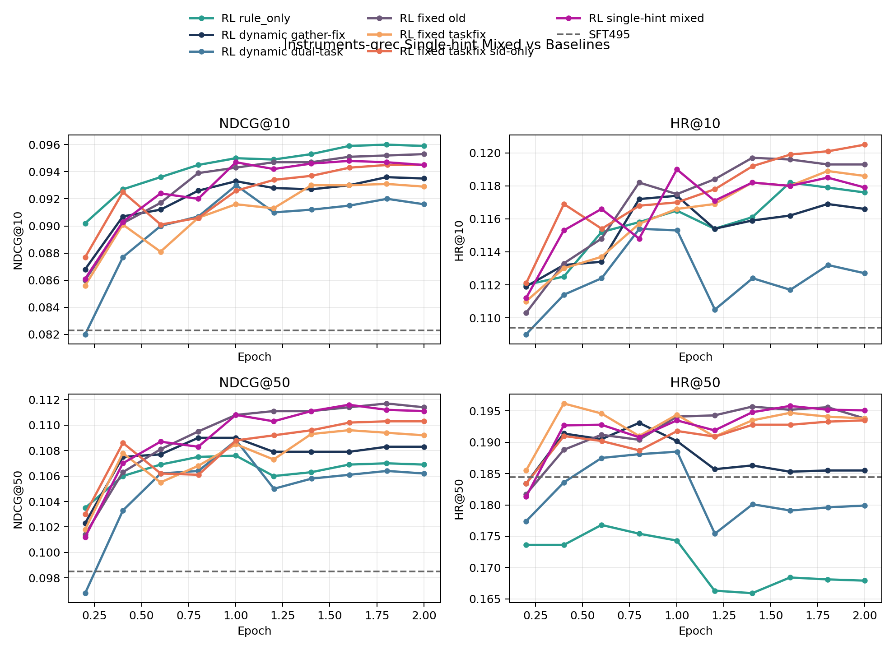
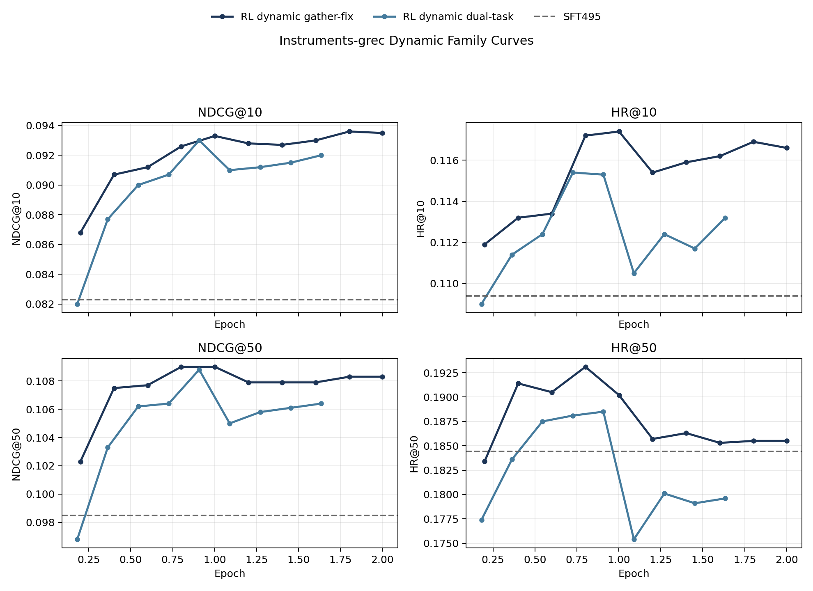
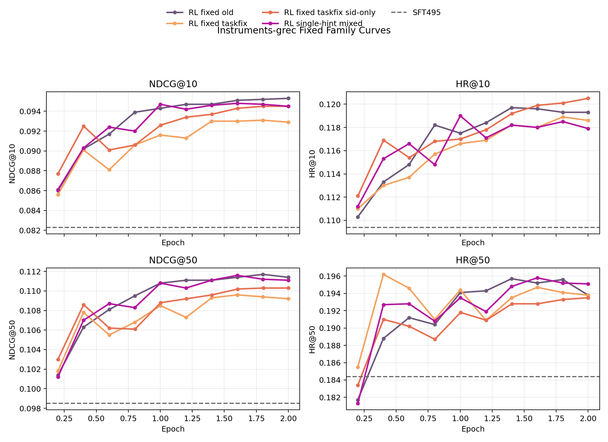

# 2026-04-19 Instruments 双任务过滤 / 单任务 Hint 训练跟踪

- 记录日期：2026-04-19
- 最后更新：2026-04-20
- 目标：把这轮 `Instruments-grec` 新开的两种训练 setting 记成一份可持续续写的 tracking note，并对齐当前本地 `results/` 同步状态。
- 当前状态：`bash scripts/sync_results_from_remote.sh unpack` 已在本地完成；当前本地 `results/` 快照里，`single-hint mixed` 已同步到完整 `checkpoint-3326`，`dynamic dual-task` 已同步到 `9` 个 checkpoint（`checkpoint-302` 到 `checkpoint-2718`），`fixed dual-task` 仍未出现在当前 `results/` / manifest 快照里。

## 1. 这次在跟踪哪两种 setting

这轮实际有 3 个 launcher，但只对应 2 种研究问题：

1. 只训练两个任务：
   从 mixed RL 任务里移除 `task4_hisTitle2sid`，只保留 `task1_sid_sft + task5_title_desc2sid` 做 train，eval 仍只看 `task1_sid_sft`。
2. 只 hint 一个任务：
   训练时仍保留 mixed RL 三任务，但 fixed hint 只注入 `task1_sid_sft`，`task4/task5` 强制 zero-hint。

## 2. Setting 一览

### 2.1 只训练两个任务：`task1_sid_sft + task5_title_desc2sid`

两条 launcher 共享同一套基础超参：

- base checkpoint：`saves/qwen2.5-3b/full/Instruments-grec-sft-qwen4B-4-256-dsz0/checkpoint-495`
- data variant：`Instruments_grec_index_emb-qwen3-embedding-4B_rq4_cb256-256-256-256_dsInstruments_ridFeb-10-2026-05-40-47`
- reward：`rule_only`
- `num_beams=16`
- `train/eval batch size=64/64`
- `grad_acc=4`
- `epochs=2`
- `lr=1e-5`
- `eval_step=100`
- `max_completion_length=128`
- `beta=1e-3`
- `temperature=1.0`
- `eval_task_names=task1_sid_sft`

#### A. Dynamic hint dual-task

- hope 脚本：
  `hope/Qwen2_5-3B-Isntruct-qwen4B-4-256-MIMIGenRec-grec/Qwen2_5-3B-Isntruct-qwen4B-4-256-MIMIGenRec-grec-rl-rule-only-dynamic-hint-sid-title-desc.sh`
- 默认 train task：
  `task1_sid_sft,task5_title_desc2sid`
- dynamic hint 设定：
  `dynamic_hint_max_depth=3`
- eval 设定：
  `dynamic_hint_apply_to_eval=false`
- 预期训练输出目录：
  `rl_outputs/Instruments-grec-grpo-rule-only-dynamic-hint-sid-title-desc-qwen2.5-3b-qwen4B-4-256-from-sft495`
- 预期结果目录：
  `results/Instruments-grec-grpo-rule-only-dynamic-hint-sid-title-desc-qwen2.5-3b-qwen4B-4-256-from-sft495`

#### B. Fixed hint dual-task

- hope 脚本：
  `hope/Qwen2_5-3B-Isntruct-qwen4B-4-256-MIMIGenRec-grec/Qwen2_5-3B-Isntruct-qwen4B-4-256-MIMIGenRec-grec-rl-rule-only-fixed-hint-sid-title-desc.sh`
- 默认 train task：
  `task1_sid_sft,task5_title_desc2sid`
- beam hint analysis task：
  默认就是 train subset，也就是 `task1_sid_sft,task5_title_desc2sid`
- fixed hint export：
  先在 `temp/rl_beam_hint/` 下生成 dual-task 对应的 `summary/details`，再导出本轮专属的 fixed hint map
- eval 设定：
  `fixed_hint_apply_to_eval=false`
- 预期训练输出目录：
  `rl_outputs/Instruments-grec-grpo-rule-only-fixedhint-taskfix-b16-sid-title-desc-sft495`
- 预期结果目录：
  `results/Instruments-grec-grpo-rule-only-fixedhint-taskfix-b16-sid-title-desc-sft495`

### 2.2 只 hint 一个任务：mixed-task + fixed hint on `task1`

- hope 脚本：
  `hope/Qwen2_5-3B-Isntruct-qwen4B-4-256-MIMIGenRec-grec/Qwen2_5-3B-Isntruct-qwen4B-4-256-MIMIGenRec-grec-rl-rule-only-fixed-hint-sid-hint-only-mixed.sh`
- 训练数据：
  仍然走默认 mixed RL 数据，不额外传 `train_task_names`
- fixed hint 注入 task：
  `fixed_hint_task_names=task1_sid_sft`
- beam hint analysis / export task：
  `analysis_task_names=task1_sid_sft`
- eval task：
  `eval_task_names=task1_sid_sft`
- 解释：
  这条线不是“只训练 task1”，而是“训练仍保留 mixed task，但只有 task1 会拿到 fixed hint；task4/task5 在 train-time 继续存在，但按 zero-hint 路径走”
- 预期训练输出目录：
  `rl_outputs/Instruments-grec-grpo-rule-only-fixedhint-taskfix-b16-sid-hint-only-mixed-sft495`
- 当前已同步结果目录：
  `results/Instruments-grec-grpo-rule-only-fixedhint-taskfix-b16-sid-hint-only-mixed-sft495`

## 3. 当前 result 跟踪

### 3.1 `single-hint mixed` 已经补到完整 `checkpoint-3326`

当前本地 `results/` 已同步到：

- `checkpoint-333`
- `checkpoint-666`
- `checkpoint-999`
- `checkpoint-1332`
- `checkpoint-1665`
- `checkpoint-1998`
- `checkpoint-2331`
- `checkpoint-2664`
- `checkpoint-2997`
- `checkpoint-3326`

指标来源：

- `results/Instruments-grec-grpo-rule-only-fixedhint-taskfix-b16-sid-hint-only-mixed-sft495/checkpoint-*/metrics.json`

当前 best readout（按已同步 checkpoint 范围内的 `NDCG@10` / `NDCG@50` / `HR@50`）：

| Variant | Best checkpoint | NDCG@10 | HR@10 | NDCG@50 | HR@50 |
| --- | --- | ---: | ---: | ---: | ---: |
| `fixedhint-taskfix-b16-sid-hint-only-mixed` | `checkpoint-2664` | `0.0948` | `0.1180` | `0.1116` | `0.1958` |

完整同步到的点：

| Checkpoint | NDCG@10 | HR@10 | NDCG@50 | HR@50 |
| --- | ---: | ---: | ---: | ---: |
| `checkpoint-333` | `0.0861` | `0.1112` | `0.1012` | `0.1813` |
| `checkpoint-666` | `0.0903` | `0.1153` | `0.1070` | `0.1927` |
| `checkpoint-999` | `0.0924` | `0.1166` | `0.1087` | `0.1928` |
| `checkpoint-1332` | `0.0920` | `0.1148` | `0.1083` | `0.1908` |
| `checkpoint-1665` | `0.0947` | `0.1190` | `0.1108` | `0.1935` |
| `checkpoint-1998` | `0.0942` | `0.1171` | `0.1103` | `0.1919` |
| `checkpoint-2331` | `0.0946` | `0.1182` | `0.1111` | `0.1948` |
| `checkpoint-2664` | `0.0948` | `0.1180` | `0.1116` | `0.1958` |
| `checkpoint-2997` | `0.0947` | `0.1185` | `0.1112` | `0.1952` |
| `checkpoint-3326` | `0.0945` | `0.1179` | `0.1111` | `0.1951` |

和 full mixed fixed-hint baseline
`results/Instruments-grec-grpo-rule-only-fixedhint-taskfix-b16-sft495`
在同 checkpoint 的对照读法：

- `single-hint mixed` 现在已经不只是 early-window candidate，而是开始形成更明确的中后段 best 区间。
- 它在 `checkpoint-2664` 的 `NDCG@10=0.0948 / HR@50=0.1958`，已经高过 corrected `fixed taskfix sid-only` 的 `NDCG@10=0.0945 / HR@50=0.1935`。
- `checkpoint-3326` 没有把 top-10 再推高，但尾段仍然维持在 `NDCG@10=0.0945 / HR@50=0.1951`，所以更合理的说法已经是：
  这条线在完整 `2.0` epoch 尾段仍站在 fixed family 前沿，而不是只靠中段 bump。

### 3.2 `dual-task sid+title_desc` 现在已经有 `9` 个 dynamic readout

截至当前这次本地 `results/` 快照，`fixed dual-task` 结果目录仍然不存在：

- `results/Instruments-grec-grpo-rule-only-fixedhint-taskfix-b16-sid-title-desc-sft495`

但 `dynamic dual-task` 已经开始同步，并且 `results/.wandb_eval_manifest.json` 里也有对应 `model_dir` 条目。

当前把它们记成：

- `dynamic dual-task` 已有 `checkpoint-302/604/906/1208/1510/1812/2114/2416/2718` 这 `9` 个 checkpoint
- raw full-trace 口径现在按它自己的 `2718 step = 2 epoch` 去算，所以这条线的 `epoch_progress` 是 `0.222 -> 2.000`，不会再被别的 run 的总 ckpt 压扁
- 如果要做共同 late-window 对比，则看新增的 `late_epoch_aligned_*` 资产：它只对齐当前已经生成出来的前 `9` 个 slot，并把它们映射到共同的 `aligned_epoch=1.75 -> 1.9722`；最后一个 `2.0` slot 仍视为 pending。这里是 epoch 对齐，但 checkpoint 不要求对齐
- `fixed dual-task` 仍待同步
- 后续仍然可以把两条线并列跟踪，不用再改主 note 结构

### 3.3 Derived comparison assets

- raw checkpoint-level tables:
  - [`single_hint_tracking_checkpoint_metrics.csv`](/Users/fanghaotian/Desktop/src/GenRec/docs/assets/2026-04-19-instruments-dual-task-single-hint-tracking/single_hint_tracking_checkpoint_metrics.csv)
  - [`single_hint_tracking_best_summary.csv`](/Users/fanghaotian/Desktop/src/GenRec/docs/assets/2026-04-19-instruments-dual-task-single-hint-tracking/single_hint_tracking_best_summary.csv)
  - [`sft495_reference_metrics.csv`](/Users/fanghaotian/Desktop/src/GenRec/docs/assets/2026-04-19-instruments-dual-task-single-hint-tracking/sft495_reference_metrics.csv)
- late-window aligned tables:
  - [`late_epoch_aligned_checkpoint_metrics.csv`](/Users/fanghaotian/Desktop/src/GenRec/docs/assets/2026-04-19-instruments-dual-task-single-hint-tracking/late_epoch_aligned_checkpoint_metrics.csv)
  - [`late_epoch_aligned_best_summary.csv`](/Users/fanghaotian/Desktop/src/GenRec/docs/assets/2026-04-19-instruments-dual-task-single-hint-tracking/late_epoch_aligned_best_summary.csv)
- figure assets:
  - [`single_hint_vs_baselines_epoch_curves.png`](/Users/fanghaotian/Desktop/src/GenRec/docs/assets/2026-04-19-instruments-dual-task-single-hint-tracking/single_hint_vs_baselines_epoch_curves.png)
  - [`single_hint_vs_dynamic_family_epoch_curves.png`](/Users/fanghaotian/Desktop/src/GenRec/docs/assets/2026-04-19-instruments-dual-task-single-hint-tracking/single_hint_vs_dynamic_family_epoch_curves.png)
  - [`single_hint_vs_fixed_family_epoch_curves.png`](/Users/fanghaotian/Desktop/src/GenRec/docs/assets/2026-04-19-instruments-dual-task-single-hint-tracking/single_hint_vs_fixed_family_epoch_curves.png)
  - [`single_hint_vs_baselines_late_epoch_aligned_curves.png`](/Users/fanghaotian/Desktop/src/GenRec/docs/assets/2026-04-19-instruments-dual-task-single-hint-tracking/single_hint_vs_baselines_late_epoch_aligned_curves.png)
  - [`single_hint_vs_dynamic_family_late_epoch_aligned_curves.png`](/Users/fanghaotian/Desktop/src/GenRec/docs/assets/2026-04-19-instruments-dual-task-single-hint-tracking/single_hint_vs_dynamic_family_late_epoch_aligned_curves.png)

## 4. Manual Picture Comparison

### 4.1 当前可见轨迹：`single-hint mixed` 已经能放到主 baseline 里看

- [`single_hint_vs_baselines_epoch_curves.png`](/Users/fanghaotian/Desktop/src/GenRec/docs/assets/2026-04-19-instruments-dual-task-single-hint-tracking/single_hint_vs_baselines_epoch_curves.png)

这张图的读法要分两层：

1. 它已经足够说明 `single-hint mixed` 不只是“一个孤立的新 launcher”，而是能被稳定放进当前 `Instruments` 主 baseline 族里一起比较。
2. 它现在已经同步到完整 `checkpoint-3326`，图上能直接看到 `epoch=2.0` 的尾段；因此这里已经不是“等最后一个点”，而是读尾段是否稳住。

按当前可见 best checkpoint 比：

| Variant | Best checkpoint | Best epoch | NDCG@10 | HR@50 |
| --- | --- | ---: | ---: | ---: |
| `rule_only` | `checkpoint-2997` | `1.802` | `0.0960` | `0.1681` |
| `dynamic gather-fix` | `checkpoint-2997` | `1.802` | `0.0936` | `0.1855` |
| `dynamic dual-task` | `checkpoint-1510` | `1.111` | `0.0930` | `0.1885` |
| `fixed old` | `checkpoint-3326` | `2.000` | `0.0953` | `0.1938` |
| `fixed taskfix` | `checkpoint-2997` | `1.802` | `0.0931` | `0.1941` |
| corrected `fixed taskfix sid-only` | `checkpoint-2652` | `2.000` | `0.0945` | `0.1935` |
| `single-hint mixed` | `checkpoint-2664` | `1.602` | `0.0948` | `0.1958` |

当前最重要的读法：

- 即使放到当前完整 raw full-trace 里看，`single-hint mixed` 也已经站到了 fixed family 附近，而不是掉回 dynamic 或 plain `rule_only` 的区域。
- 它相对 `dynamic gather-fix` 的当前可见 best 点，多 `+0.0012` `NDCG@10`、多 `+0.0103` `HR@50`，已经明确站进 fixed family 的 region。
- `fixed old` 也已经被重新拉回来了，它在这张图里更像一条历史上界参考线：`NDCG@10=0.0953 / HR@50=0.1938`，比 corrected `fixed taskfix sid-only` 略强一点，但带 legacy caveat。
- `single-hint mixed` 相对 corrected `fixed taskfix sid-only` 的当前 best 点，已经多 `+0.0003` `NDCG@10`、多 `+0.0023` `HR@50`；所以这条线现在已经可以被视为一个真实的主候选，而不是旁支。
- `single-hint mixed` 的完整尾点 `checkpoint-3326` 仍维持 `HR@50=0.1951`，所以这条线现在更像“完整 2 epoch 也没掉出前沿”的主候选，而不再只是中段幸运点。
- `dynamic dual-task` 目前的 raw full-trace best 在 `checkpoint-1510 / epoch=1.111 / NDCG@10=0.0930 / HR@50=0.1885`，比 canonical `dynamic gather-fix` 仍弱，但已经足够纳入后续 dual-task 跟踪。

### 4.2 Dynamic Family

- [`single_hint_vs_dynamic_family_epoch_curves.png`](/Users/fanghaotian/Desktop/src/GenRec/docs/assets/2026-04-19-instruments-dual-task-single-hint-tracking/single_hint_vs_dynamic_family_epoch_curves.png)

这张图现在只保留 dynamic family：

- `dynamic gather-fix`
- `dynamic dual-task`

最有用的读法：

- `dynamic dual-task` 现在已经不是“只有一个 early readout”，而是同步到了完整 `9` 个 checkpoint，一直到 `checkpoint-2718`；raw full-trace best 仍在 `checkpoint-1510 / epoch=1.111 / NDCG@10=0.0930 / HR@50=0.1885`。
- 但它相对 canonical `dynamic gather-fix` 仍然全线偏弱：
  `NDCG@10 -0.0006`、`HR@50 -0.0030`。
- 所以当前更合理的说法不是“dual-task dynamic 已经赢了 dynamic baseline”，而是：
  它已经进入可比较状态，但还没有超 `gather-fix`。

### 4.3 Late-Window Epoch Alignment

- [`single_hint_vs_baselines_late_epoch_aligned_curves.png`](/Users/fanghaotian/Desktop/src/GenRec/docs/assets/2026-04-19-instruments-dual-task-single-hint-tracking/single_hint_vs_baselines_late_epoch_aligned_curves.png)
- [`single_hint_vs_dynamic_family_late_epoch_aligned_curves.png`](/Users/fanghaotian/Desktop/src/GenRec/docs/assets/2026-04-19-instruments-dual-task-single-hint-tracking/single_hint_vs_dynamic_family_late_epoch_aligned_curves.png)

这组图不是 raw `epoch_progress`，而是专门为当前 `dynamic dual-task` 的 `9` 个已生成 readout 做的比较轴：

- 把 `dynamic dual-task` 现有 `9` 个 checkpoint 当作锚点数。
- 各条线都只取与这 `9` 个已生成 slot 对应的前缀点；如果最后一个 terminal slot 还没生成，就不把它硬塞进来。
- 再把这 `9` 个点统一映射到 `aligned_epoch=1.75 -> 1.9722`。
- 所以这里是 epoch 对齐，但 checkpoint 不要求对齐；同时不会把一个还没生成的最后点硬映成 `2.0`。

按这套 aligned 资产去读：

- `dynamic dual-task` 在共同 late-window 轴上的 best 点仍是 `checkpoint-1510 @ aligned_epoch=1.8611`。
- `single-hint mixed` 在这套轴上的 best 点是 `checkpoint-2664 @ aligned_epoch=1.9444`；当前 aligned 资产只用到 `checkpoint-2997 @ aligned_epoch=1.9722`，不会提前消费 terminal `checkpoint-3326`。
- 这样看最大的好处是：`dynamic dual-task` 不会再因为别的 run 的总 ckpt 更长，而在 late-window 视角里被直接裁掉；同时也不会把“还没生成的最后一个点”假装成已经对齐好的 `2.0`。

### 4.4 Fixed Family

- [`single_hint_vs_fixed_family_epoch_curves.png`](/Users/fanghaotian/Desktop/src/GenRec/docs/assets/2026-04-19-instruments-dual-task-single-hint-tracking/single_hint_vs_fixed_family_epoch_curves.png)

这张图现在专门看 fixed family：

- `fixed old`
- `fixed taskfix`
- corrected `fixed taskfix sid-only`
- `single-hint mixed`

这张图最关键的读法是：

- `single-hint mixed` 现在已经不只是“接近 fixed family”，而是开始站到 fixed family 的前沿区域。
- 它当前 full-trace best 在 `checkpoint-2664 / NDCG@10=0.0948 / HR@50=0.1958`，已经同时超过 corrected `fixed taskfix sid-only` 的 `0.0945 / 0.1935`。
- 和 `fixed old` 比，它仍然还差一点 top-10（`0.0948` vs `0.0953`），但 `HR@50` 已经更高（`0.1958` vs `0.1938`）。
- 因此现在最值得继续解释的，不再只是“single-hint 有没有信号”，而是：
  它为什么能在完整尾段继续维持住相对 corrected clean fixed 的领先。

## 5. 下一步怎么续写

- 下一次同步 result bundle 时，优先检查 `fixed dual-task` 线是否开始出现在 `results/` 和 manifest 里。
- `single-hint mixed` 已经补到完整 `checkpoint-3326`；下一步不是继续等点，而是解释为什么它在 `2664 -> 3326` 之间维持高位平台但没有继续抬高 top-10。
- 一旦 dual-task 线有结果，优先把它们和下面两条 reference 放在一起做 first-look：
  - `dynamic gather-fix`
  - corrected `fixed taskfix sid-only`
- 这条实验线后续继续写这篇文档，不再新建近重复 top-level note。
