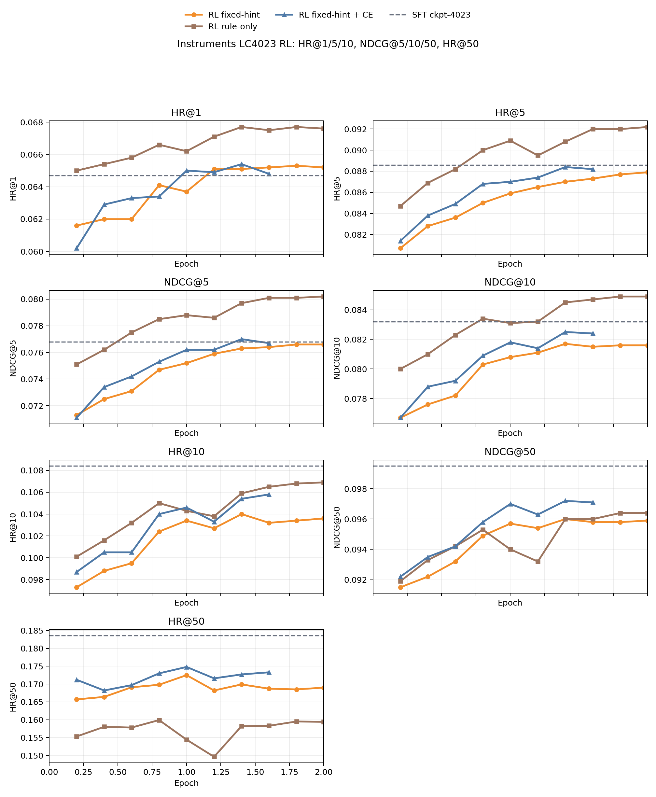
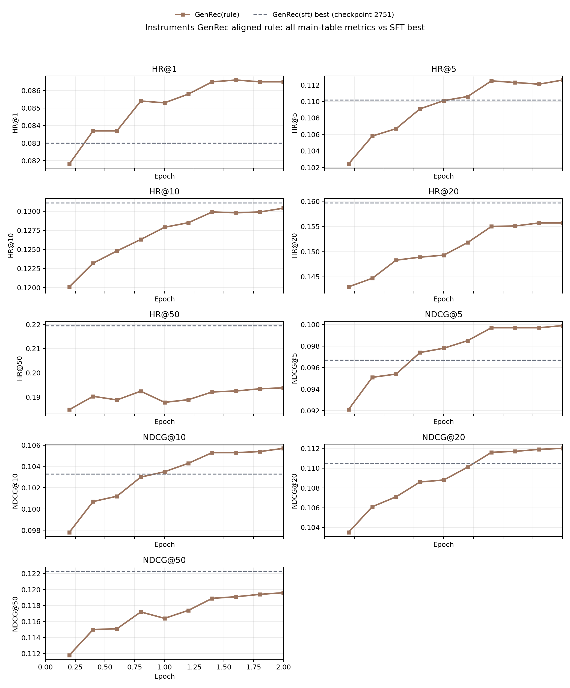
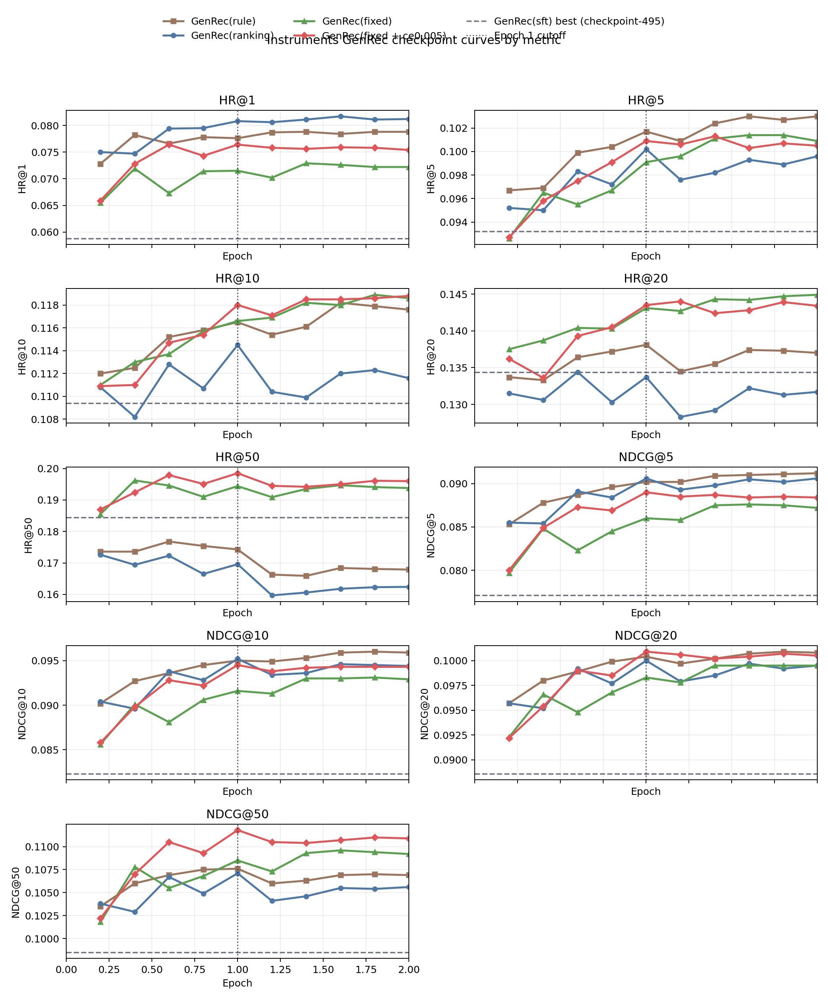

# GenRec 周报（2026-05-14，LC-Rec 对齐回顾与回切）

- 记录日期：2026-05-14
- 汇报范围：上周围绕 `LC-Rec` 数据 / index 复用、原始 index 回切、以及下一步基线口径调整的阶段性结论
- 参考材料：`docs/daily/2026-04-29-genrec-main-results-weekly.md`、`docs/baseline/lc_rec_multidataset_table.tex`、`docs/baseline/genrec-baseline.tex`、`docs/baseline/table/genrec-only-tables.tex`

## 1. 本周结论

1. 上周先尝试直接复用 `LC-Rec` 的数据和 index，补跑了 `Instruments / Arts / Games` 三个数据集的 SFT，并在 `Instruments` 上继续跑了 `rule`、`fixed` 和 `fixed + ce0.001`。但这条线整体没有拿到理想结果，尤其是 RL 对 SFT 的提升幅度很有限。
2. 后面切回我们原来的 index 后，传统 baseline 重新完整跑了一遍，`Caser / GRU4Rec / BERT4Rec / SASRec / TIGER` 的口径已经重新对齐；在这个基础上，按 LC-Rec 对齐方式重跑的 SFT 能拿到一个更像样的起点，但 `Instruments rule` 的 RL 结果依然不算好看。
3. 当前更合理的下一步，是回到原始 `GenRec(sft)` 那套 setting，把传统 baseline 再压低一点，再看 `rule / ranking / fixed / fixed + ce` 这些 RL 变体能否更稳定地拉开优势，而不是继续在 LC-Rec 对齐那套 SFT 起点上硬追。

## 2. 复用 LC-Rec 数据 / index：三数据集 SFT 与 Instruments RL 都不理想

上周的第一条主线，是尽量复用 `LC-Rec` 已有的数据和 index 设定，先把三数据集的 SFT 跑出来，再在 `Instruments` 上接 `rule`、`fixed`、`fixed + ce0.001` 这几条 RL 线。从结果上看，这条路线目前更像一次必要的排查，而不是已经能直接作为主线的方案。

### 2.1 三数据集 SFT 复现实测

| Dataset | Paper LC-Rec NDCG@10 | Repro best ckpt | Repro HR@10 | Repro NDCG@10 | Delta vs paper |
| --- | ---: | --- | ---: | ---: | ---: |
| Instruments | 0.0926 | `ckpt-4023` | 0.1084 | 0.0832 | -0.0094 |
| Arts | 0.0906 | `ckpt-12951` | 0.1051 | 0.0754 | -0.0152 |
| Games | 0.0681 | `ckpt-14904` | 0.0945 | 0.0532 | -0.0149 |

这张表说明，当前复用 `LC-Rec` 数据 / index 跑出来的 SFT，在三个数据集上都还没有追平论文主表，`NDCG@10` 都存在比较明显的差距。

### 2.2 Instruments 上的 RL 复现实测

| Variant | Checkpoint | HR@10 | NDCG@10 | NDCG@50 | HR@50 |
| --- | --- | ---: | ---: | ---: | ---: |
| Paper LC-Rec | -- | 0.1220 | 0.0926 | -- | -- |
| GenRec eval SFT | `ckpt-4023` | 0.1084 | 0.0832 | 0.0995 | 0.1836 |
| GenRec `rule-only` RL | `ckpt-5006` | 0.1069 | 0.0849 | 0.0964 | 0.1594 |
| GenRec `fixed-hint` RL | `ckpt-3507` | 0.1040 | 0.0817 | 0.0960 | 0.1699 |
| GenRec `fixed-hint + ce0.001` RL | `ckpt-3507` | 0.1054 | 0.0825 | 0.0972 | 0.1727 |

*图 1：`LC-Rec` 对齐设定下，`Instruments` 上 `rule-only / fixed / fixed + ce0.001` 的 epoch 曲线。*

这一组结果最值得强调的点有两个。

- 第一，RL 确实没有把这条线真正拉起来。`rule-only` 相比 SFT 只把 `NDCG@10` 从 `0.0832` 拉到 `0.0849`，而 `HR@50` 还从 `0.1836` 掉到 `0.1594`。
- 第二，`fixed + ce0.001` 比 plain `fixed` 稍微更稳一些，`NDCG@10` 从 `0.0817` 回到 `0.0825`，`HR@50` 也从 `0.1699` 提到 `0.1727`，但它仍然没有把这条 LC-Rec 对齐路线救回来。

当前比较合理的工作假设是：这套 `LC-Rec` 对齐 SFT 起点，并没有给后续 RL 留出一个足够好的优化空间。现象上看，SFT 本身已经把模型带到一个后续 `rule / fixed` 只能做小修小补、但很难把主指标真正继续抬高的位置，所以整体读出来就是“能跑通，但不好看”。

## 3. 切回原始 index：baseline 已补齐，但 Instruments rule 仍然不够漂亮

在确认复用 `LC-Rec` 数据 / index 这条线没有明显优势之后，后面就切回了我们原来的 index，把传统 baseline 全部重新按当前口径跑了一遍。当前至少在 `Instruments` 上，`Caser / GRU4Rec / BERT4Rec / SASRec / TIGER` 和新的 `GenRec(sft) / GenRec(rule)` 已经可以放在一张表里直接比较。

### 3.1 Instruments 当前主表

| Method | HR@10 | NDCG@10 | NDCG@50 | HR@50 |
| --- | ---: | ---: | ---: | ---: |
| Caser | 0.0825 | 0.0591 | 0.0757 | 0.1593 |
| GRU4Rec | 0.1203 | 0.0962 | 0.1148 | 0.2068 |
| BERT4Rec | 0.1193 | 0.0918 | 0.1109 | 0.2073 |
| SASRec | 0.1082 | 0.0805 | 0.1005 | 0.2011 |
| TIGER | 0.1207 | 0.0945 | 0.1139 | 0.2097 |
| LC-Rec / GenRec(sft) | 0.1311 | 0.1033 | 0.1223 | 0.2195 |
| GenRec(rule) | 0.1304 | 0.1057 | 0.1196 | 0.1938 |

*图 2：切回原始 index 后，`Instruments-grec-genrec-aligned-rule` 的完整 checkpoint 曲线。*

这张表说明两件事。

- 第一，传统 baseline 现在已经重新收拢到一套可直接比较的当前口径里了，后面无论是讲“GenRec 有没有赢”，还是讲“哪条 RL 线最值”，基础参照都会更清楚。
- 第二，新的 `GenRec(rule)` 在 `NDCG@10` 上确实比对齐后的 SFT 更高，`0.1057 > 0.1033`，但它的 `HR@50` 明显更低，`0.1938 < 0.2195`。所以它仍然不是那种“指标一眼就很好看”的结果，更像是前排排序变强、覆盖率代价比较大的典型 `rule-only` 曲线。

也就是说，回到原始 index 之后，问题已经不再是“这条线完全跑不通”，而是“能跑通，但目前的 RL 结果还不够漂亮”。

## 4. 下一步：回到 original GenRec(sft) setting，再把 baseline 压低一点

从当前结果看，更值得继续的方向，还是回到原始 `GenRec(sft)` 这一套 setting，把传统 baseline 再尽量压低一点，再看 RL 线的相对优势能不能稳定放大。下面这张表可以直接作为下一步最实用的参考口径。

### 4.1 Original GenRec(sft)-Based / GenRec-only 参考表（Instruments）

| Variant | HR@10 | NDCG@10 | NDCG@50 | HR@50 |
| --- | ---: | ---: | ---: | ---: |
| GenRec(sft) | 0.1094 | 0.0823 | 0.0985 | 0.1844 |
| GenRec(rule) | 0.1179 | 0.0960 | 0.1070 | 0.1681 |
| GenRec(ranking) | 0.1145 | 0.0952 | 0.1071 | 0.1696 |
| GenRec(fixed) | 0.1189 | 0.0931 | 0.1094 | 0.1941 |
| GenRec(fixed + ce0.005) | 0.1180 | 0.0945 | 0.1118 | 0.1985 |

*图 3：原始 `GenRec(sft)` 基座下，`Instruments` 各条 RL 变体的完整 checkpoint 曲线。*

这张表更接近我们现在真正想保留的主故事。

- `rule-only` 仍然是最强的 `NDCG@10` 线，但 `HR@50` 掉得最明显，典型地是在拿 coverage 换 top-10。
- `fixed` 和 `fixed + ce0.005` 更像当前真正有继续做价值的方向，尤其是 `fixed + ce0.005` 把 `HR@50` 抬到了 `0.1985`，同时还保住了 `0.0945` 的 `NDCG@10`。
- 如果后面要讲“我们的 RL 线为什么值得继续”，原始 `GenRec(sft)` 这套 setting 下的故事比 `LC-Rec` 对齐那套要顺得多。

因此，当前更合理的下一步不是继续围着 `LC-Rec` 对齐 SFT 做增量修补，而是回到原始 `GenRec(sft)` setting，把传统 baseline 压低一点，再让 `rule / ranking / fixed / fixed + ce` 这些 RL 线在一个更有利的参考系里比较。

## 5. 下周建议

1. 以原始 `GenRec(sft)` 为主基座继续汇报，`LC-Rec` 对齐路线保留为一次已完成的对照尝试，不再作为主故事展开。
2. 后续如果继续追 `Instruments`，优先讲 `fixed` 和 `fixed + ce0.005`，因为这两条线更能体现“在 coverage 不明显塌掉的前提下继续提升”的价值。
3. 传统 baseline 既然已经重新完整跑通，接下来就应该优先把“baseline 能不能再压低一点、对照能不能更公平”这件事做扎实，这会直接影响后面周报里的主结论强度。
